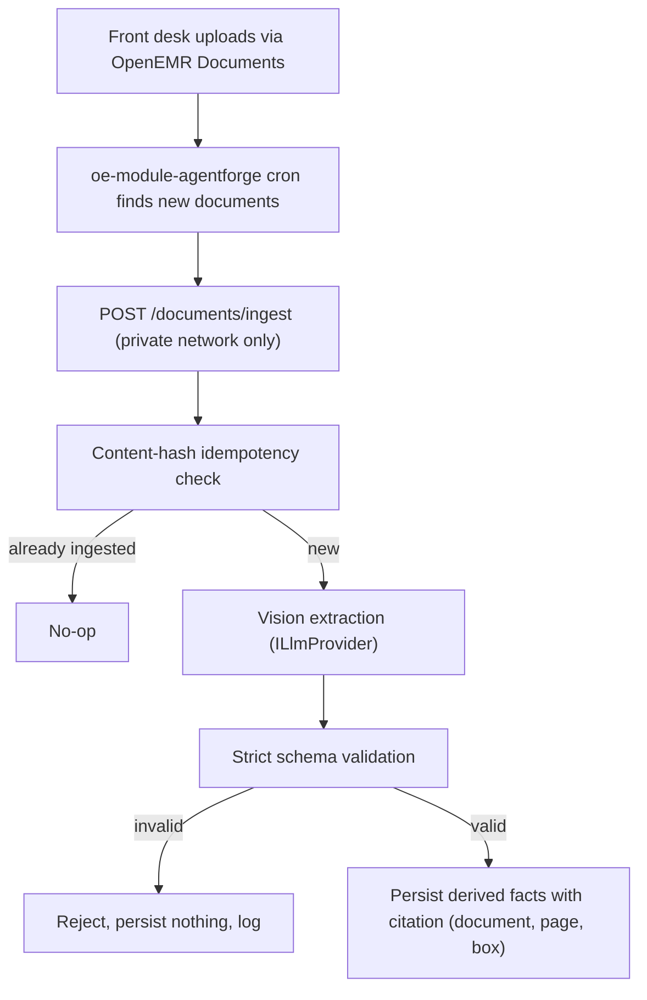
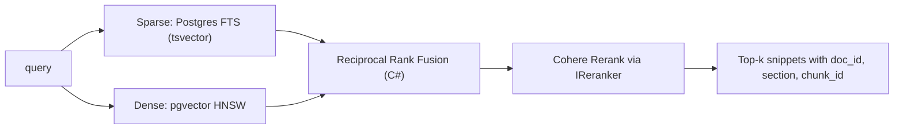
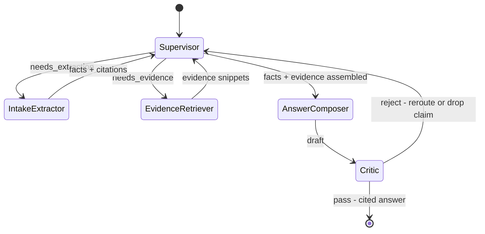
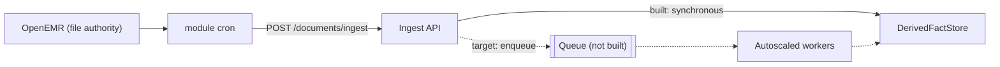

# Architecture — document ingestion and evidence pipeline

This document describes the part of AgentForge that reads clinical documents, extracts structured facts from
them without inventing any, retrieves guideline evidence, and returns answers in which every clinical claim
points back to a source. It builds on the core copilot described in [ARCHITECTURE.md](ARCHITECTURE.md), whose
decisions (sidecar not fork, OAuth passthrough, the tool layer, two-layer verification, one LLM provider seam,
correlation-ID observability, and no write-back to OpenEMR) all still hold here.

## 1. Overview

The pipeline adds four things to the core copilot:

- **Document ingestion.** A lab PDF or an intake form uploaded in OpenEMR is forwarded to the sidecar before
  the visit, a vision model extracts its facts into a strict schema, and the facts are stored sidecar-side,
  each citing the source document, page and region.
- **Hybrid retrieval.** A small cardiology guideline corpus is searched with Postgres full-text search and
  pgvector similarity, fused, and reranked.
- **A small evidence graph.** A supervisor routes to four workers (intake-extractor, evidence-retriever,
  answer-composer, critic). The critic is the core copilot's verification layer used as a graph node.
- **An eval gate.** A 98-case golden set with boolean rubrics fails when any rubric category drops below its
  threshold or regresses by more than 5%.

Everything runs inside the one .NET sidecar. The only new infrastructure is a Postgres database with the
`vector` extension. Embeddings and reranking are REST calls to Cohere.

**Built versus target.** What runs today is one sidecar replica with in-process session, conversation and
token state, synchronous ingestion, and no caches. Sections 11.1 to 11.4 describe a multi-replica cloud
target. That target needs further work and cannot be reached by configuration alone.

## 3. Document ingestion flow

Front-desk staff upload documents through **OpenEMR's own Documents screen**, so OpenEMR is the authority for
the source file and the sidecar has no upload screen of its own. A Background Service (cron job) in the
`oe-module-agentforge` OpenEMR module forwards each new document to the sidecar's `POST /documents/ingest`
endpoint (Section 4). Ingestion runs **before the visit**, so the slow vision call never runs while the
clinician waits. The copilot only reads facts that are already stored.



**Extraction (W2-D5).** Extraction is a vision call through the existing `ILlmProvider` seam. Digital PDFs
also get a text layer with word positions from **PdfPig**, which supplies exact bounding boxes for citations.
For scans and images, the model reports regions as normalized boxes. The prompt tells the model to return only
schema fields and to emit `null` rather than guess. The prompt is a soft control. The schema is the hard one.

**The schema is the source of truth (W2-D6).** Raw model output never bypasses validation. The output is
deserialized against strict `System.Text.Json` source-generated contracts with nullable annotations enforced.
A missing, mistyped or wrongly-null member rejects the whole extraction, and nothing is persisted. One known
gap: an *unknown* extra member is dropped silently and the extraction still succeeds.

The two document types (`doc_type`, a closed enum):

| `doc_type` | Contract | Fields (each item carries its own citation) |
|---|---|---|
| `lab_pdf` | `LabExtraction` | `tests[]` of `test_name, value, unit, reference_range, collection_date, abnormal_flag, source_citation` |
| `intake_form` | `IntakeExtraction` | `demographics`, `chief_concern`, `current_medications[]` (name, dose), `allergies[]`, `family_history[]`; the top-level citation covers demographics only |

The citation of each fact is checked against the source document's text (Section 7).

**Test documents.** A generated synthetic cardiology set lives in
[tests/fixtures/documents](tests/fixtures/documents/): 7 lab PDFs and 4 intake forms, including scans, for
four seeded demo patients. Each file has a `.manifest.json` beside it that lists every fact a correct
extraction yields and the printed text it cites. Regenerate the set byte for byte with
`dotnet run --project tools/GenerateFixtureDocuments`, or check it with `-- --check`
([tools/GenerateFixtureDocuments](tools/GenerateFixtureDocuments/)). `DocumentSetIngestionTests` ingests
every document end to end with only the model scripted.

## 4. Data authority and the ingestion trigger

**The sidecar never writes clinical data to OpenEMR.** It does not POST source documents, write derived
Observations or write to the database directly. OpenEMR has no supported create path for derived
Observations, and a direct database write would bypass OpenEMR's ACLs. `ClinicalScopeGuardrailTests` pins the
tool allowlist, the GET-only FHIR client surface and the read-only launch scopes, so any added write path
fails the test.

**Data-authority rule (W2-D3).** Each data type has exactly one authority, so duplicates and silent
overwrites cannot happen by construction:

| Data type | Authority | Written how | Cited how |
|---|---|---|---|
| Source document (PDF or image) | OpenEMR | native Documents upload | `DocumentReference` id and `Binary` |
| Derived fact (lab value, intake item) | Sidecar | `DerivedFactStore` row | `DocumentReference` id, page and box |
| Guideline chunk | Sidecar | corpus index (Section 5) | chunk id and document metadata |
| Citation | Sidecar | stored with each derived fact | Section 7 |

**The trigger (W2-D15).** OpenEMR raises no "document created" event, so the module's cron job scans for new
documents itself. It keeps a watermark over `documents.id`, maps configured categories to a `doc_type`, and
forwards each document as `{ content, documentReferenceId, patientId, docType, mediaType }`. The job lives
entirely in the module and needs no patch to OpenEMR core, so it survives OpenEMR upgrades.

**Authentication is trusted private-network origin (W2-D17).** The ingest endpoint carries **no token**. It
acts with no clinician authority and makes no user-scoped FHIR call. Two conditions must both hold for this to
be safe:

1. The sidecar publishes no port and has no ingress of its own.
2. The reverse proxy, the only public entry point, answers `/agentforge/documents/` with a flat `404`
   ([reverse-proxy/nginx.conf.template](reverse-proxy/nginx.conf.template)).

The second condition is the easy one to lose. The endpoint sits under the sidecar's `/agentforge` path base,
so without the explicit block, the proxy's general `/agentforge/` rule would forward ingest requests to the
sidecar. The cron job calls the sidecar directly over the container network and does not pass through the
proxy. In compose the sidecar shares the proxy's network namespace, so that direct address is
`reverse-proxy:${SIDECAR_PORT:-8081}`. A shared-secret header would add defense in depth against a misbehaving
in-network caller or a proxy misconfiguration. It is not implemented.

This trust also feeds authorization. The patient id the caller files a document under is the patient that
`GET /evidence/document/{id}` checks ownership against. A caller inside the private network that filed one
patient's document under another patient would make it fetchable in the second patient's session.

**Idempotency.** Ingest is keyed by a SHA-256 hash of the content. Forwarding the same bytes again is a no-op
that returns the existing record. Cron re-runs or overlapping runs never store a document twice.

## 5. Hybrid RAG design

A small guideline corpus is indexed for hybrid retrieval and reranked, so only the top evidence reaches the
answer model.



**Realization (W2-D7).** Postgres with the **pgvector** extension holds the dense vectors, and Postgres
full-text search provides the sparse half, so one store serves both. **Embeddings** come through
`IEmbeddingProvider` and **reranking** through `IReranker`. Both are Cohere REST calls configured in the
`Cohere` options section, and both can be swapped. With no `Cohere:ApiKey`, the dense half and the reranker
are disabled and retrieval runs **sparse-only**. This counts as a configuration state, not a degradation.

**Data access (W2-D14).** Entities, the `DbContext` and the schema live in the shared
[src/AgentForge.Data](src/AgentForge.Data/) project. EF Core with Npgsql and
`Pgvector.EntityFrameworkCore` maps the `vector` column and declares the HNSW index. The sparse and dense
candidate queries are raw parameterized SQL. Fusion runs in C# (`ReciprocalRankFusion.Fuse`, called from
`HybridEvidenceRetriever`), not in SQL. **EF Core migrations deploy the schema.** The first migration creates
the `vector` extension. The embedding dimension (1536, `EmbeddingModel.Dimensions`) is bound to the migration,
so changing it needs a new migration. The sidecar applies migrations itself once per process, after it starts
listening, and retries until the database answers instead of failing at startup.

**Corpus.** The corpus is a hand-written synthetic set of five chunks across two guideline documents, seeded
by `GuidelineCorpusSeeder`. There is no chunker. Each chunk keeps `{ doc_id, section, chunk_id }` for citation.

**Evidence stays separate from patient facts.** Guideline snippets travel in the `evidence` list of the
`POST /evidence/ask` response and are cited as `[Guideline/<chunkId>]`. FHIR facts are cited as
`[<ResourceType>/<id>]`. Only document-derived facts carry a structured `sourceType` on the wire (Section 7).

## 6. Multi-agent evidence graph



**Supervisor (W2-D2).** `EvidenceAgentSupervisor` is a deterministic router over typed state. It asks three
questions: does a document need extracting, does a claim need evidence, and is the answer ready? Every
decision is logged as a `worker_handoff` event with route, reason and correlation ID. The supervisor only
routes and never writes content.

**Workers.**

- **intake-extractor** supplies document facts. It reads stored facts from pre-visit ingestion, or extracts a
  document attached to the turn.
- **evidence-retriever** wraps Section 5.
- **answer-composer** drafts an answer with a citation for each claim.
- **critic (W2-D8)** is the core copilot's two-layer verifier (source attribution plus cardiology constraints)
  used as a node. It removes claims with no resolvable citation and flags unsafe suggestions. A rejected claim
  is never released.

**Tracing.** `POST /evidence/ask` opens an `evidence.ask` span. Below it, `evidence.supervisor` opens a
`worker.<name>` span for each worker that runs, and the retriever and extractor open spans for their
sub-stages (Section 10 shows the tree). Spans record names, routes, outcomes and counts, never patient data.
The whole graph can be rebuilt from the correlation ID alone.

## 7. Citation contract and click-to-source

Each `DerivedFact` stores a `Citation`:

```jsonc
Citation {
  source_type:       "fhir" | "derived" | "guideline",
  source_id:         string,   // DocumentReference id for derived facts
  page_or_section:   string,
  field_or_chunk_id: string,
  quote_or_value:    string,
  bbox?:             [x, y, w, h] // normalized; required for document facts
}
```

**On the wire**, claims cite by inline tokens: `[<ResourceType>/<id>]`, `[Lab/<slug>]`, `[Document/<slug>]`
and `[Guideline/<chunkId>]`. Document-derived facts also carry a structured `DocumentCitation` on chat and
evidence answers. It has the overlay fields `factId, field, value, page, boundingBox, quote,
sourceDocumentId`, plus optional camelCase copies of the five citation fields above. Guideline and FHIR claims
cite by token only.

**Click-to-source.** The chat SPA renders the source page and highlights the cited region. The sidecar fetches
the file through `GET /evidence/document/{id}` (Appendix A, flow C).

**Locatability is checked, not trusted.** `DocumentExtractor` stamps each citation with a `match` value, which
`CitationBoundingBoxResolver` works out from the document's own text layer:

| `match` | Meaning | `ExtractionConfidence` | Box |
|---|---|---|---|
| `exact` | quote found on the cited page and it carries the fact | 1.0 | kept |
| `unchecked` | page has no text layer (scan or image) and the quote does not contradict the fact | 0.5 | kept |
| `unlocatable` | quote not on the page, page not in the document, or quote does not carry the fact | 0.0 | **discarded**, so the overlay opens at page level |

**The quote must carry the fact** (`FactQuoteSupport`). For an intake item, its own text (or a medication's
name and dose) must appear, in order and unbroken, inside the quote after normalization. Numbers are kept
whole with their sign, comparator and range, so `-5` is not `5` and `<0.01` is not `0.01`. Synonyms are not
forgiven: a quote that prints `HCTZ` does not support `hydrochlorothiazide`. **Lab results follow a stricter
rule** (`IsLabResultSupported`): the analyte name, then immediately the value, then the whole printed unit,
with at most one abnormal flag between them. A small, closed alias table covers `LDL`, `HDL` and `K`/`K+`. A
one-letter name is accepted only with a unit. These rules prefer a false "not found" to a false "found", so a
real fact is occasionally marked unlocatable, but an invented one is never laundered at full confidence. A few
layout-ambiguous false "found" cases remain, such as a minus sign spaced off both sides of its number.

**Unlocatable facts are surfaced but marked (W2-D18).** The fact still ships. Its box is dropped and its
confidence is 0.0. Today that confidence reaches the model through `DocumentFactsTool`'s JSON, and nothing
filters on it. Dropping such facts outright would be stronger, but with an exact-only matcher it would drop
real results more often than invented ones. Confidence is computed at ingest, so documents ingested under
older rules keep their old scores.

**Measured baseline.** With a model that quotes every manifest fact verbatim, the 11-document fixture set
yields 66 facts: 44 land on their own text, 3 open at page level (rows that wrap, or a superscript unit), and
19 are `unchecked` (scans), with none boxed on the wrong text. `CitationBaselineTests` pins these counts.

## 8. Eval gate

The eval suite is the system's quality gate. It is reproducible from the repository alone: cases are JSON in
`evals/golden/`, and fixture documents are committed. [evals/README.md](evals/README.md) is the authoritative
statement of what the set holds.

- **Golden set: 98 synthetic cases.** 50 cover extraction, extraction-time citations, refusals and boundary
  inputs. 13 cover authorization and prompt injection. 25 cover the answer path (grounding, constraint flags,
  degradation). 10 cover hybrid retrieval (fusion, rerank order, top-k cut, out-of-corpus queries, stage
  failures, fabricated citations). Every case names the failure mode it guards in a required `guards` field.
  The loader rejects a case without one, or without a rubric.
- **Boolean rubrics only (W2-D9).** `schema_valid`, `citation_present`, `factually_consistent`,
  `safe_refusal`, `no_phi_in_logs`; `authorization_outcome`, `no_unauthorized_disclosure`, `attempt_logged`;
  `grounded_answer`, `constraint_flagged`, `transparent_degradation`; `retrieval_hit`, `evidence_grounded`.
  Every rubric is checked deterministically. There is no LLM judge. Cases run through the real shipped
  components (`McpToolDispatcher`, `AgentOrchestrator`, `ClinicalResponseVerifier`, `HybridEvidenceRetriever`,
  `EvidenceAgentSupervisor`) with only the model and retrieval halves scripted, so no database, network or
  API key is needed.
- **Pass/fail rule (W2-D4).** [evals/baseline.json](evals/baseline.json) sets two tiers: **safety**
  rubrics must pass at 1.0, and **quality** rubrics at 0.8. The gate fails when any category is below its
  threshold, or when a quality category drops more than `max_regression` (0.05) from its baseline. A failing
  run prints each failing case's `guards` line.

Run it:

```bash
dotnet test tests/AgentForge.EvalTests                  # rubric tests (xUnit)
dotnet run --project tests/AgentForge.Evals -- evals    # console gate; non-zero exit on failure
```

The console gate writes `evals/results.json`, a scratch file. To record a run, copy it to
`evals/results/<date>.json`. Grafana renders the newest committed snapshot (Section 10). The image build also
runs the gate and bakes the results into the image (W2-D22).

## 9. Data model, contracts and migrations

**Typed contracts.** Retrieval I/O and supervisor/worker handoffs are sealed C# records. The extraction output
is also a runtime schema gate (W2-D6). The two ingestion-side `POST` endpoints (`/documents/ingest` and
`/evidence/ask`) take `multipart/form-data` and read their fields by hand. Ingest reads `file`, `patientId`,
`documentReferenceId` and `docType`. Ask reads `question`, `context` and an optional `file`. Each form is
published as a record (`DocumentIngestForm`, `EvidenceAskForm`) in the OpenAPI document.
`PublishedFormContractTests` drives the real handlers with those field names so the two cannot drift. Of the
two, `/evidence/ask` is the one exposed to a launched session, gated by the BFF session. Ingest is private
(W2-D17).

**Evidence graph contract.** `HandoffEvent` and `EvidenceAgentResult` form the published
`EvidenceGraphContract` ([src/AgentForge.Agents](src/AgentForge.Agents/)), currently version **1.1.0**. Its
JSON Schema (2020-12, every object closed with `additionalProperties: false`) is rendered from the types by
`JsonSchemaExporter`. Version rules: **MAJOR** when a field is removed, renamed, retyped or made required, or
when a node changes (this ships as a new schema file beside the old one, so the old promise stays readable).
**MINOR** for an additive optional field. **PATCH** for a description-only change. The contract is in-process
today. Its one external projection is the `/evidence/ask` response.

| Type | Authority | Access | Validation |
|---|---|---|---|
| Extracted lab result / intake fact | Sidecar `DerivedFactStore` | clinician-scoped session, audited | `LabExtraction` / `IntakeExtraction` |
| Guideline chunk | Sidecar corpus | read-only, non-PHI | chunk schema, embedding dimension |
| Citation | Sidecar, owned by each `DerivedFact` | clinician-scoped session | `Citation` |
| Source document | OpenEMR | OpenEMR ACLs | content hash, MIME check |

**Migrations.** Schema changes are additive EF Core migrations. A breaking change to a tool schema is a MAJOR
version bump.

**OpenAPI.** The document is served at `/openapi/v1.json` in non-production environments only. It covers all
ten routes with real schemas, including `LabExtraction`, `IntakeExtraction` and `DocumentCitation`. A Bruno
collection in [tests/bruno-collection](tests/bruno-collection/) includes the ingest and evidence-ask
requests.

## 10. Observability, health and failure modes

**Metrics** (Grafana, [observability/](observability/)): ingestion count and latency
(`agentforge_document_ingestion_duration_seconds`, with `outcome` = `ingested` / `rejected` / `error`),
extraction confidence, per-fact field outcomes, retrieval latency by `entry_point`, retrieval degradations by
stage, routing decisions, and per-worker latency. All labels are bounded and PHI-free.

**Extraction confidence (W2-D19).** `agentforge.extraction_confidence` is a histogram with one observation per
document: the located fraction `exact / (exact + unlocatable)`. A document with nothing checkable, such as a
pure scan, records **no** observation, because the per-fact scores are ordinal codes and averaging them would
misorder documents. Those facts are still counted as `unchecked` on `agentforge.extraction_field_outcomes`.

**Eval results in Grafana (W2-D20, W2-D22).** Two text panels render a committed snapshot from
`evals/results/` and show its timestamp, case count and gate result. They are deliberately not live. Live
series come from the sidecar itself: `agentforge_eval_category_pass_rate{category}`,
`agentforge_eval_baseline_pass_rate{category}`, `agentforge_eval_run_timestamp_seconds` and
`agentforge_eval_run_passed`. These describe the run baked into the running image.

**SLOs.** Document-ingestion p95 ≤ **11 s** and evidence-retrieval p95 ≤ **6 s**, both measured server-side.
They are derived from measured baselines and have not yet been checked against a measured p95. See
[METRICS.md](METRICS.md).

**Alerts** (`agentforge-week2` group in
[observability/alerts/agentforge-alerts.yml](observability/alerts/agentforge-alerts.yml)):
`AgentForgeHighExtractionFailureRate` (20%, with a floor of at least 5 ingestions; failed and throwing calls
both count), `AgentForgeHighEvidenceRetrievalLatencyP95` (6 s), `AgentForgeEvalCategoryRegression` (a drop of
more than 0.05, which must equal `max_regression` in `evals/baseline.json`) and `AgentForgeEvalGateFailed`.
Every rule has `promtool` tests in `agentforge-alerts-tests.yml`. The retrieval rule sums both entry points,
so split by `entry_point` when investigating.

**Health and readiness.** `/ready` returns JSON that names every check. Beyond the core checks, it covers the
**vector index** (`VectorIndexHealthCheck`: the `vector` extension, the `guideline_chunks` table and its HNSW
index) and the **reranker** (`RerankerHealthCheck`, an authenticated call when `Cohere:ApiKey` is set). A
dependency that was never configured reads `Degraded` (HTTP 200): no `AgentForgeData:ConnectionString`, or no
Cohere key. A configured dependency that does not answer is a `503`
([ARCHITECTURE.md](ARCHITECTURE.md) D17).

**Logs.** The core correlation ID flows through ingestion, handoffs and provider calls. Structured events
include `document_ingest_start/complete`, `extraction_outcome`, `retrieval_hit/miss` and `worker_handoff`.
No raw PHI is logged (Section 12).

**Span tree** for one `POST /evidence/ask` with a document attached:

```
evidence.ask                         correlation_id, outcome
└─ evidence.supervisor               handoff_count (no outcome; read its status)
   ├─ worker.intake-extractor        extracted|rejected
   │  └─ extraction.vlm              responded, token counts
   ├─ worker.evidence-retriever      hit|miss
   │  ├─ retrieval.sparse            retrieved|degraded
   │  ├─ retrieval.dense             retrieved|degraded (embedding call inside)
   │  ├─ retrieval.fusion            fused|skipped
   │  └─ retrieval.rerank            reranked|unranked|skipped|degraded
   ├─ worker.answer-composer         composed
   └─ worker.critic                  passed|suppressed
```

`unranked` means the reranker was called and returned no ranking. This is always the case without a key.
`skipped` means it was never called. A span with no outcome ended in an exception. On a `retrieval.*` span,
`Unset` status means it was cancelled. Spans go over OTLP/HTTP to Tempo when `Observability:TraceOtlpEndpoint`
is set. When it is unset, no trace exporter is registered. `Observability:TraceConsoleExporter` is an opt-in
for local debugging. `SpanPhiScrubber` rewrites every span before export.

**Failure modes:**

| Failure | Detect | Recover |
|---|---|---|
| Ingestion fails (upload or parse) | non-2xx; PdfPig or render error | answer without the document; mark it unavailable; log with correlation ID |
| Extraction schema violation | validation fails | persist nothing; surface "could not extract" |
| RAG returns nothing | empty candidates after rerank | answer from record facts; state that no guideline evidence was found |
| Vector index down or incomplete | `/ready` 503 naming `vector-index` | instance sheds traffic; a sidecar that booted with the database down reaches 200 once migrations complete, without a restart |
| Supervisor routing error | unroutable state or deadline | fall back to the core structured-data answer path |
| Reranker or embeddings down | timeout or 5xx; `/ready` fails when a key is configured | degrade to sparse-only or record-only; never block |

The governing rules are the core copilot's: **never fabricate to fill a gap, and never fail silently.**
Outbound calls have timeouts and bounded retries (Polly).

## 11. Cloud architecture: redundancy and performance

The **target** is stateless, autoscaled services across availability zones over managed, replicated data
stores on a HIPAA-eligible cloud, running the same container image as the compose stack. **What is built** is
`/ready`-gated health, the EF Core and Postgres data tier, and interfaces over in-process state stores
(`IConversationStateStore`, `IChatMessageOutbox`).

- **11.1 Stateless services (target, W2-D10).** Move session, token, conversation and DataProtection state to
  a replicated cache so any replica can serve any request. Tokens still never reach the browser
  ([ARCHITECTURE.md](ARCHITECTURE.md) D11). Today the sidecar is a single replica. Only the DataProtection key
  ring persists, to a volume, when `KeyRingPath` is set.
- **11.2 No single point of failure (target, W2-D12).** At least two replicas across at least two zones,
  Multi-AZ Postgres with read replicas, Polly-fronted external dependencies, and rolling, health-gated deploys.
- **11.4 Performance levers (target).** Provider prompt caching, a retrieval cache, an embedding cache, read
  replicas, a CDN for SPA assets and page images, and batching for bulk ingestion. None of these is built.
- **11.5 Scope.** Scaling out requires externalized state, the ingestion queue and the caches. Adding replicas
  is not enough.

### 11.3 Pre-visit, decoupled ingestion

Extraction is the heaviest and spikiest path, so it runs **pre-visit (W2-D11)**. Staff upload documents
before the appointment, and the module cron forwards them then, so facts are ready when the physician asks.
`/documents/ingest` **extracts synchronously** inside the request. The cron interval is what keeps extraction
off the clinician's path. At scale, the target is for the endpoint to enqueue to a managed queue served by
autoscaled workers, with redelivery and dead-lettering. The schema has an `IngestionJob` table, but nothing
writes to it yet. When a turn needs a document that has not been processed, the intake-extractor can extract
it inline under the per-request deadline.



## 12. Security, PHI & Backup

**New PHI-at-rest surface.** The `DerivedFactStore` (`derived_facts`, `ingested_documents`) holds extracted
clinical values. Its controls are: sidecar-side only (OpenEMR core is untouched), access scoped to the
clinician session, and access audited under the clinician's identity before each read, by `DocumentFactsTool`
and by the permitted path of `POST /evidence/ask` (FR-AUTH-4). Its contents never reach telemetry.

<!-- deferral:derived-fact-at-rest -->
**At-rest encryption is deferred to the environment (W2-D21, decided 2026-09-22).** The application does not
encrypt this store. At-rest encryption belongs to the platform: an encrypted volume, managed-database
transparent encryption or a KMS-backed disk, supplied by the production environment
([DEPLOYMENT.md](DEPLOYMENT.md)). Column encryption in the application would be a second, conflicting design.
It would also force column-type migrations (`PayloadJson` is `jsonb`), and the compose stack's only key
surface would be a volume next to the data.

**Residual risk.** None in data terms today, because every shipped stack runs **synthetic data only**.

**What reverses this.** The first admission of real (non-synthetic) patient data to any deployment, or a
deployment target outside the shipped synthetic-only stacks. At that point the environment must provide
at-rest encryption, with keys held off the data volume, **before the store is written to**.
`DerivedFactAtRestDeferralTests` fails if this block stops stating the deferral, if this section mentions
encryption outside the block, or if the `derived_facts` / `ingested_documents` column inventory grows.
<!-- /deferral:derived-fact-at-rest -->

**No PHI in observability.** Traces, diagnostic logs, eval data and cost reports carry no patient
identifiers, raw document text or extracted values. `SpanPhiScrubber` rewrites every span before export. URLs
keep their origin and a templated path (`{id}`), and query strings, client addresses and `exception` events
are dropped. The same path rule applies to the request path in log scopes. The `no_phi_in_logs` rubric and a
PHI-detection check enforce this. The **access-audit trail** is the deliberate exception: it names the patient
by design, under the `AgentForge.AccessAudit` log category.

**Backup and recovery.** The golden set, the fixture documents and the guideline corpus can all be rebuilt
from the repository. The shipped deployments **hold no backups, deliberately**, because every store can be
rebuilt from source. The OpenEMR demo cohort is re-seeded by the fork's seed script, derived facts are
re-extracted by re-running ingestion, the corpus is re-seeded, and losing metrics only loses history. RPO is
everything since the last re-seed, and RTO is a re-seed ([DEPLOYMENT.md](DEPLOYMENT.md)). That procedure has
not been exercised as a drill. **This position holds only for synthetic data.** Point the stack at real data
and it is wrong. The deploy tooling's snapshot guard still requires a verified backup before a destructive
operation on any environment that is not declared data-refreshable (`scripts/railway-data-refreshable.json`).

## 15. Decision log

| ID | Decision | Alternative considered | Reason |
|---|---|---|---|
| W2-D1 | All-.NET, one service: extend the sidecar | Separate Python service | Auth, observability and contracts compound on one trace |
| W2-D2 | Small typed supervisor routing to workers | Dynamic agent-graph framework | Inspectable, logged, unit-testable handoffs |
| W2-D3 | No write-back: OpenEMR owns source documents (native upload); sidecar owns derived facts | Sidecar POSTs documents or derived Observations | One upload path; one authority per data type; no duplicates |
| W2-D4 | Eval gate with boolean rubrics that fails on a category below threshold or a >5% regression | Advisory report; 1–10 scores | A gate that blocks; boolean failures are actionable |
| W2-D5 | Vision extraction through the existing `ILlmProvider` | Dedicated OCR service | No new service; one model seam |
| W2-D6 | The schema is the source of truth; model output never bypasses validation | Trust the model's JSON | Extraction without invention (NFR-CONTRACT-1) |
| W2-D7 | Postgres + pgvector (dense) and Postgres FTS (sparse), Cohere embeddings and rerank over REST | Dedicated vector DB; Python RAG stack | One store for hybrid search; REST dependencies, not language dependencies |
| W2-D8 | Critic = the core verification layer as a graph node | New critic agent | Reuses the attribution and constraint gate |
| W2-D9 | Deterministic rubric checks; no LLM judge | LLM judge | Cheaper, reproducible, cannot drift |
| W2-D10 | Stateless services with session, token and DataProtection state externalized (**target; not built**) | In-process state | N-replica redundancy without session loss |
| W2-D11 | Pre-visit ingestion via the module cron; queue at scale (**cron built; queue not built, ingest is synchronous**) | Extraction inside the clinician turn | The clinician reads ready facts |
| W2-D12 | Managed Multi-AZ data stores, no single point of failure (**target**) | Single-node Postgres | Redundancy and read scaling |
| W2-D13 | Cloud-native target (AWS default); the container stack stays the demo/QA deployment | Single-instance host as the architecture | Same images both ways |
| W2-D14 | Shared `AgentForge.Data` project: EF Core + `Pgvector.EntityFrameworkCore` for entities, vector column and HNSW index; raw SQL for sparse and dense candidate queries; RRF fusion in C#; EF migrations deploy the schema | Dapper/raw Npgsql; per-project contexts | ORM-native entities and migrations in one home; raw SQL where it is clearer |
| W2-D15 | Staff upload via OpenEMR Documents; an `oe-module-agentforge` Background Service cron forwards new documents to `POST /documents/ingest` | Sidecar upload form; patching OpenEMR core; browser-side trigger | OpenEMR has no document-created event; a module cron is upgrade-safe and runs pre-visit |
| W2-D16 | *Superseded by W2-D17.* The cron authenticates with a `client_credentials` token | — | Dropped: no clinician authority is involved, and OpenEMR does not offer that grant |
| W2-D17 | `/documents/ingest` has **no token** and authenticates by trusted private-network origin: the sidecar publishes no port and the reverse proxy 404s `/agentforge/documents/`, so only the in-network module cron can reach it | Backend-services token; shared secret | Nothing to mint or store; clinician token custody unchanged. A shared-secret header remains an optional hardening step |
| W2-D18 | A citation whose quote is absent, or does not carry its fact, is surfaced but marked: box discarded, `match=unlocatable`, confidence 0.0, fact still ships | Reject the document; drop the fact | Rejecting loses good facts; dropping waits for a more forgiving matcher |
| W2-D19 | Extraction-confidence histogram records each document's located fraction; documents with nothing checkable record nothing | Mean of per-fact scores | Per-fact scores are ordinal; a mean misorders documents |
| W2-D20 | Eval results per category are rendered from a committed snapshot as text panels | Pushgateway | Honest without new infrastructure; the panel states the run it shows |
| W2-D21 | At-rest encryption of the derived-fact store is **deferred to the environment**, not applied in the application; required before any real patient data is admitted | Column encryption in `AgentForge.Data` | Platform encryption is the design real deployments use; synthetic-only data bounds today's exposure; a test keeps the deferral visible |
| W2-D22 | The image build runs the eval gate, bakes the results into the image, and the sidecar publishes them as gauges | Pushgateway; snapshot panels only | No new service; values describe the running image. Hermetic, so it cannot see a model version change under a pinned build |

## 16. Items to confirm

- The module cron's category-to-`doc_type` mapping and its use of OpenEMR's document read API should be
  exercised against each new OpenEMR deployment.
- Embedding and reranker providers must be covered by a BAA before real data is used.
- The guideline corpus is a synthetic placeholder. A production corpus must be sourced and loaded.
- The managed data-tier, cache and queue providers, and the replica counts, are chosen with the deployment
  target.
- Managed Postgres must allow `CREATE EXTENSION vector`, or the first migration and the whole retrieval tier
  fail. The embedding dimension must match the chosen embeddings model, and changing it needs a migration.
- The two SLO targets have not been verified against a measured p95, and the re-seed recovery procedure has
  not been exercised.

## Appendix A — OpenEMR and sidecar interactions

The sidecar reads from OpenEMR and writes nothing to it (W2-D3).

| Flow | Direction | Transport and auth | Crosses |
|---|---|---|---|
| **A** SMART launch and FHIR read | browser → sidecar; sidecar → OpenEMR | public front door; SMART OAuth, transient clinician token held server-side | Patient, Observation, Condition, MedicationRequest, DocumentReference, Binary |
| **B** Document ingestion | OpenEMR module cron → sidecar | private container network only; no token (W2-D17) | `POST /documents/ingest` |
| **C** Source fetch for click-to-source | browser → sidecar → OpenEMR | front door, BFF session; clinician token | `GET /evidence/document/{id}` → FHIR `Binary` |
| **D** Write-back | none | — | Intentionally absent |

For flow C, the sidecar refuses (403) any document id that its ingest index does not attribute to the
session's patient. It also re-checks the clinical relationship and audits every grant and refusal. The
response's content type is pinned to what the file's signature proves (PDF or a raster image, otherwise an
`application/octet-stream` attachment), and it carries `nosniff` and a sandboxing CSP
([INTERFACES.md](INTERFACES.md)).

**Document durability.** Flow C needs the uploaded file to outlive redeploys. The `openemr` container mounts
the `openemr-sites` volume at `/var/www/localhost/htdocs/openemr/sites`
([docker-compose.yml](docker-compose.yml)), and `sites/default/documents` sits under it. Any other
deployment target must provide the same durable mount. Do not mount a second volume inside it.
