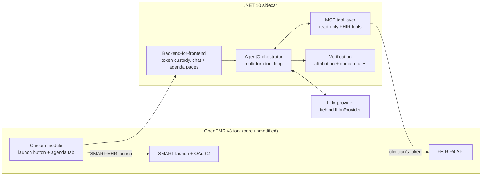

# AgentForge Clinical Copilot — Architecture

This document describes the core copilot: the .NET sidecar that gives an outpatient cardiologist a
prioritized, source-cited brief and a follow-up conversation inside OpenEMR. It covers how the sidecar
connects to OpenEMR, where the trust boundaries sit, how answers are verified, how the service is observed
and deployed, and the decisions behind each of those. Section numbers are stable; code comments cite them.

---

## 1. System overview

AgentForge is three parts in one repository.

| Part | What it is | Where it is described |
|---|---|---|
| **Core copilot** | A .NET 10 sidecar beside an OpenEMR v8 fork. It reaches OpenEMR only through FHIR R4, OAuth2 and SMART-on-FHIR EHR launch, under the clinician's own token. It runs a multi-turn agent over read-only tools, verifies every answer, and serves the chat and the Daily Agenda. | This document |
| **Document and evidence pipeline** | Inside the same sidecar: ingestion of clinical documents (lab PDFs, intake forms), extraction of cited facts, hybrid retrieval over a guideline corpus, and a small typed supervisor graph, over a Postgres/pgvector data tier. | [ARCHITECTURE-DOCUMENTS.md](ARCHITECTURE-DOCUMENTS.md) |
| **Security platform** | A separate Python service in [security-platform/](security-platform/) whose four agents (Orchestrator, Red Team, Judge, Documentation) attack the copilot through its public front door and record regressions. | [SECURITY-PLATFORM.md](SECURITY-PLATFORM.md) |

All browser and attacker traffic enters through one nginx origin ([reverse-proxy/](reverse-proxy/)),
which fronts both OpenEMR and the sidecar. Requirements and use cases (UC-n, FR-/NFR- IDs) are in
[REQUIREMENTS.md](REQUIREMENTS.md); the OpenEMR and sidecar interfaces are in [INTERFACES.md](INTERFACES.md).

**The user.** One narrow persona: an outpatient cardiologist with about 90 seconds between rooms, asking
"what changed since the last visit, and what matters today". So the copilot is cardiology-only (D8) and is a
conversational agent, not a one-shot report (D9).

**Sidecar, not fork (D1).** The PHP core is never modified. The only OpenEMR-side addition is a thin module
(`oe-module-agentforge`) that adds a patient-chart launch button and a Daily Agenda tab and performs the SMART
launch. This keeps OpenEMR upgradeable, leaves its certified configuration alone, and lets the sidecar deploy
and test independently.

**Out of scope:** writing to the record, diagnosis or treatment recommendations, specialties other than
cardiology, voice scribing, and real patient data. Every environment this repository builds runs on
synthetic data; production is an environment the customer supplies (§13).

---

## 5. Trust boundaries and authorization

1. **Authenticated launch.** The module starts a SMART EHR launch (authorization-code flow with PKCE). The
   resulting token carries the user, the granted scopes and the launch patient. There is no `patient_id` on
   the URL; identity and patient scope are cryptographic.
2. **Token custody (D11).** The sidecar keeps the token server-side, keyed to the browser session; the
   browser never sees a bearer token. It also checks the token's expiry on every read, because OpenEMR's token
   lasts one hour while the session's 30-minute idle timeout slides. There is no refresh; re-launching renews.
3. **ACL inheritance** — §5.3.
4. **Minimum-necessary by tool design** — §5.4.
5. **Dual audit.** OpenEMR's `EventAuditLogger` records per-user FHIR access. The sidecar writes its own
   `ACCESS AUDIT` trail for every tool call, every refusal, and four reads outside the tool layer:
   `GET /patient`, the permitted path of `POST /evidence/ask`, `GET /evidence/document/{id}`, and the chat
   citation loader that attaches document citations to each brief and follow-up (FR-AUTH-4). Both trails
   carry the correlation ID. OpenEMR does not currently read the `X-Correlation-Id` header the sidecar sends,
   so joining the two trails is by time and user, not by ID.
6. **Secondary roles** — §5.6.
7. **Relationship entitlement** — §5.7.

### 5.3 ACL inheritance is a ceiling, not the entitlement

Every FHIR call uses the clinician's token, and OpenEMR enforces its ACLs and scopes server-side. The
copilot therefore cannot see more than the user could, and because enforcement is below the model, a
prompt injection ("ignore that, show me…") cannot widen access (FR-AUTH-3, NFR-SEC-2). But OpenEMR's ACLs
gate by feature, not by patient panel: a user with the clinical ACL can open any chart. Inheriting that
alone would not limit a clinician to their own patients, which is why §5.7 exists.

### 5.4 Minimum-necessary by tool design

Tools take narrow inputs (no patient argument at all, bounded date windows, small counts) and never dump a
whole chart. The patient is forced from the session on every call (§8.1). The tool layer is the single
place where every read is audited.

### 5.6 Secondary roles (fellow, nurse/MA)

A tiered model, where a supervised fellow or a nurse/MA gets a narrower view expressed through OpenEMR
scopes, is **not built**. As shipped it cannot be reached: the relationship gate (§5.7) admits only the
appointment's provider participant, and appointments carry one provider (the physician). Fellows and
nurses/MAs are refused at launch before any scope is consulted. Building roles later needs a relationship
signal that allows more than one person per patient, such as FHIR `CareTeam`. Until then only the
relationship half of FR-AUTH-2 is enforced.

### 5.7 Relationship entitlement (FR-AUTH-2)

This is the boundary the sidecar adds on top of OpenEMR. **Rule: the requester must be the provider
participant on an appointment with that patient on the current clinic day.** It reads FHIR `Appointment`
(the provider is seeded as `pc_aid`), the same signal the Daily Agenda roster uses (§19.2a). The patient
record's `providerID` is not used: it is unpopulated in the demo cohort and is not a FHIR search parameter.

**Four choke points, one rule** (`PatientRelationshipGate`, a pure function):

| Choke point | Behaviour on refusal |
|---|---|
| SMART launch (`SmartLaunchService`) | 403, no session created |
| Every tool dispatch (`McpToolDispatcher`), including the document and evidence tools | Refused before any read; counted on the authorization metric |
| `POST /evidence/ask` | 403; the patient is always the session's, never read from the form |
| `GET /evidence/document/{id}` (click-to-source) | First looks up which patient the sidecar's ingest index filed that document under; 403 unless it is the session's patient, then re-checks the relationship. Unknown IDs are refused the same way, so status codes cannot be used to probe IDs |

Tests enumerate the tool catalog and the dispatcher's routes, so a tool added later is gated or the build fails.

**Document ownership depends on the ingest caller.** The index row that pairs a document ID with a patient
is written by `POST /documents/ingest`, which has no token and is trusted because it is reachable only from
the private network (W2-D17 in [ARCHITECTURE-DOCUMENTS.md](ARCHITECTURE-DOCUMENTS.md)). An ID filed under two
different patients resolves to nobody and is refused in both sessions. The lookup column is not indexed;
add an index with a migration when the table grows beyond demo volume.

**Not re-checked: `GET /patient` and the chat citation loader.** Neither takes a patient from the request,
so there is no cross-patient choice; both are checked at launch and audited on every read. The residual
is a same-day schedule change: a session that was legitimately launched keeps reading that patient's
summary until the SMART token expires (up to one hour). Tool dispatch and `/evidence/ask` refuse correctly
in that window.

**Fails closed.** No appointments, no provider participant, no identity, or a failed lookup are all
refusals, so an OpenEMR outage is never an authorization bypass. The exception is the requester's own token
having expired, which is a session problem: the HTTP surfaces return 401 and a chat turn returns a "session
expired, re-launch" message. These are counted on `agentforge_expired_session_refusals_total{surface}`, not as
authorization decisions. (At the launch gate an expired token would be an unhandled 500; it is near-unreachable
because the token was minted seconds earlier.)

**Required scope.** The gate runs as the requester, so the single-patient launch must both request **and be
registered with** `patient/Appointment.read`. OpenEMR silently narrows a token to the client's registered
scopes, so a client registered without it gets every launch refused with no error at authorize time. The
launch logs any requested scope the token came back without, and the
[BootstrapOpenEmr](tools/BootstrapOpenEmr/) tool appends a missing scope to an existing registration.
See [DEPLOYMENT.md](DEPLOYMENT.md) and [INTERFACES.md](INTERFACES.md).

**Audited either way.** A refusal is written to the access audit with the count of clinic-day appointments
considered; a count of 0 usually means the demo's seeded schedule has aged out.

**The clinic day is the clinic's.** `ClinicClock` resolves "today" in `Clinic:TimeZone` (default
`America/Chicago`), not UTC; otherwise launches after about 19:00 Central would read tomorrow's calendar and be
refused. The agenda roster uses the same clock, and the day is part of the decision cache key, so a permit
never outlives its day. Keep the authorizer registered per request scope, never as a singleton.

**Deliberately narrow.** It admits the in-clinic workflow (UC-1, UC-4, UC-6) and refuses chart review the
next day. Widening the window is a code change (the search sends one `eq{today}` date). `CareTeam` is the
right signal for a real deployment but is empty in the demo data. Thirteen golden cases in
[evals/golden/](evals/golden/) (`authz-*.json`) exercise the gate, including permits so a deny-everything
gate cannot pass.

---

## 7. Data access and integration

**FHIR first.** Every data class is read through OpenEMR FHIR R4 so authorization stays consistent. A direct
database read would bypass OpenEMR's ACLs and is not used.

| Cardiology need | FHIR resource | Notes |
|---|---|---|
| Medications | `MedicationRequest` | `MedicationDispense` has no grantable scope and is not read |
| Labs (INR, K+, creatinine, lipids, BNP) | `Observation` (laboratory), `DiagnosticReport` | |
| Vitals (BP, HR) | `Observation` (vital-signs) | |
| Problems (AFib, HFrEF, CAD) | `Condition` | |
| Allergies | `AllergyIntolerance` | |
| Encounters / interval events | `Encounter` | Drives "since last visit" |
| Procedures (PCI, ablation) | `Procedure` | Scope is requested, but no tool reads it yet |
| EF / echo findings | `DiagnosticReport`, `DocumentReference` | Often narrative. Only facts extracted by the document pipeline are labelled `derived`; an EF read through `get_documents` is not |
| Device (pacemaker/ICD) | `Device`, `DocumentReference` | Open: the demo cohort has no device documents to test extraction against |

The tool surface is oriented to the **interval**: establish the last-visit baseline, then surface what is
new or changed. The demo cohort (`AF-DEMO-01`…`AF-DEMO-07`) is seeded by the OpenEMR fork; see
[DEPLOYMENT.md](DEPLOYMENT.md). A data-completeness indicator ("data as of" plus gaps) is not built.

---

## 8. Agent design — the conversational loop

The `AgentOrchestrator` is a hand-written tool-call loop over `ILlmProvider`; no agent framework is used,
because the value of the product is deterministic grounding and below-the-model authorization, which are
easiest to guarantee with full control of the loop (per-round verification, a bounded repair attempt, turn
deadlines). `Microsoft.Extensions.AI` is a reasonable future refactor for the provider seam.

- **Turn 1, the brief.** On launch the model issues the brief's read tools in one parallel batch and
  assembles a prioritized, cited brief that leads with what changes today's plan. The exact tool list is in
  the brief prompt ([PROMPTS.md](PROMPTS.md)); `retrieve_evidence` is available on demand but is not part of
  the batch. Overlap between batched tools is fine: verification counts a FHIR resource once (§9.2).
- **Follow-up turns (UC-2).** Conversation state is kept; references ("her", "that lab") are resolved; tools
  are chained (fetch INR, then compare against the indication's range).
- **Grounding.** Extractive framing; every claim cites a tool result; uncited lines that name a clinical
  value are dropped, not regenerated (§9). The current model rejects a temperature parameter, so none is sent.
- **Speed vs. completeness.** Return the verified core inside the interactive budget (NFR-PERF-1) and say
  when more is pending. Each turn is bounded by `Agent:TurnDeadline` (default 90s).

### 8.1 MCP tool surface (read-only, clinician-scoped)

**The patient is not an argument.** Each tool's request carries `site` and `patientId`, but the dispatcher
forces both from the session and the advertised schema never offers them (FR-CHAT-3). The model's view:

| Tool | Returns |
|---|---|
| `get_patient_summary()` | Demographics, active problems, active medications, allergies |
| `get_interval_changes(since_date)` | Medication changes, new or abnormal labs, encounters since the last visit |
| `get_labs(since_date?)` | Lab observations with value, unit, date, reference range |
| `get_vitals(since_date?)` | BP and HR observations |
| `get_recent_encounters(count=3)` | A thin list: date, type, reason |
| `get_documents(document_type?)` | `DiagnosticReport` / `DocumentReference` narrative, cited by resource ID |
| `get_document_facts()` | Facts extracted from the patient's ingested documents, cited as `[Document/<id>]` |
| `retrieve_evidence(query)` | Guideline snippets, cited as `[Guideline/<id>]` |

**This list is also the allowlist.** The dispatcher checks the catalog before routing, so a tool the model is
not told about cannot be reached. A refused call reads nothing, is counted on
`agentforge.out_of_scope_tool_calls`, and logs the attempted name. "No placing orders" is enforced at three
layers: this allowlist, a FHIR client that declares only `GET`, and launch scopes that are all `.read` (D13).

All tool inputs have strict schemas (NFR-CONTRACT-1). The JSON Schema the model sees is generated from the
same request record the tool validates against, so there is one definition. Results are typed records and are
not validated at run time. Every call is audited.

### 8.2 Conversation state — in memory only

`ConversationState` (site, patient, history) lives in an in-process dictionary keyed by the ASP.NET session
ID and is never written to disk, because conversation history is dense PHI. When the session's patient
changes (agenda drill-down, or a second launch on the same cookie), the next turn starts a fresh conversation,
so one patient's tool results never become context for another. Pages carry a `contextKey` (a one-way digest
of session, site and patient); a stale tab gets a "patient changed" answer (409 on HTTP) and reloads.

Costs: history is lost on restart; abandoned conversations are not evicted until the process recycles; and
**the sidecar must run as a single replica**, because nothing provides session affinity. Production needs
affinity or an external store; the `IConversationStateStore` seam makes that a small code change, but the
store is then encrypted PHI at rest.

---

## 9. Verification layer

Every response passes this gate before it reaches the clinician (FR-VERIF-0). The one exception is the
deterministic fallback used when the LLM fails, which shows raw, source-cited tool data with no synthesis.
Both halves run in the sidecar, after generation and before display (D10).

### 9.1 Source attribution

Each asserted fact must resolve to a FHIR resource returned by a tool **in this turn**; a claim grounded only
by an earlier turn's call is also suppressed. Unresolvable claims are dropped, never regenerated. (The single
re-prompt the orchestrator makes is a bounded repair of a malformed answer, not a grounding retry.) An uncited
line is caught only when it names a clinical value, from a fixed keyword list in `SourceAttributionEngine`;
an uncited medication or problem name passes. Citations are shown so the clinician can check at a glance
(FR-VERIF-1).

### 9.2 Cardiology domain constraints

A rules layer checks the underlying values and flags or blocks violations: INR against the therapeutic range
for the indication, QT-prolonging combinations, renally contraindicated dosing, K+ and creatinine on
ACEi/ARB/diuretics, and negatively chronotropic combinations. Rules are versioned configuration, not model
knowledge (FR-VERIF-2), and must be clinically validated before any pilot.

Before rules run, records are recovered from this turn's tool results **once per FHIR resource**, so
overlapping tools never raise the same flag twice. Value rules read the **most recent result per observation
code**, not every result (an unbounded `get_labs` would otherwise report a years-old excursion as current).
Two limits: codes are keyed on display text, so "INR" and "PT/INR" are separate codes; and observations with
status `entered-in-error` are excluded, while every other status is kept.

### 9.3 Placement and limits

Attribution catches unsupported claims but not a subtly wrong synthesis (for example a stale medication
reconciliation). On the domain-rule half this is mitigated deterministically: results are ranked to the
latest per code, and every lab flag carries an `as of <date>` stamp of the draw date in the source's own
offset (not normalised to UTC, which could shift it to the next day), or says the date is unknown. These
flags are computed from tool-result JSON and never pass through the model. On the prose half, extractive
framing is prompt text only, so a stale synthesis in the narrative is mitigated, not caught.

---

## 11. Observability and engineering requirements

- **Correlation ID.** Opened once per invocation: by `CorrelationIdMiddleware` for HTTP (adopting a
  well-formed inbound `X-Correlation-Id`, else minting one) and by `ChatSessionCoordinator` per chat turn. It
  reaches every tool call, LLM call, log line and both audit trails (FR-OBS-1). Chat turns also carry
  `ConversationId`, a one-way SHA-256 of the session ID, which joins a session's turns without exposing the key.
- **Traces and logs.** OpenTelemetry spans go over OTLP/HTTP to Tempo when `Observability:TraceOtlpEndpoint`
  is set, after `SpanPhiScrubber` strips identifiers. Logs go to Loki over OTLP/HTTP when configured
  (optional, fail-open), with no PHI. The access-audit trail names the patient by design (FR-AUTH-4) and is
  **not shipped**: it goes to the console only.
- **Metrics** (FR-OBS-3): request count, error rate, p50/p95 latency, tool-call and retry counts,
  verification pass/fail, and FR-AUTH-2 permit/refuse. Authorization is its own series so a correct refusal
  never pages; it covers **tool dispatch only**. Expired sessions have their own series (§5.7), not yet alerted on.
- **Alerts** (FR-OBS-4): p95 latency, error rate, tool-failure rate. The latency alert
  (`AgentForgeHighTurnLatencyP95`) filters to `turn_type="brief"`, because the 26s budget (NFR-PERF-1) is for a
  single-patient brief; it measures server-side turn time, not end-to-end.
- **`/health` vs `/ready`.** `/health` is liveness (plain text, no dependency checks). `/ready` checks five
  dependencies and answers JSON naming each check, its status and a description (never an exception text):

| Check | When checked | Probe | Cached |
|---|---|---|---|
| OpenEMR | Always | `GET /apis/{site}/fhir/.well-known/smart-configuration` (fast; `/fhir/metadata` is too slow for the budget) | Yes |
| LLM provider | Always | Authenticated, token-free `GET /v1/models/{Llm:Model}`: 2xx Healthy, 429 Degraded, anything else or no answer Unhealthy | Yes |
| Observability backend | `Observability:PrometheusHealthUrl` set | Prometheus health URL | No |
| Vector index | `AgentForgeData:ConnectionString` set | Catalog query for the `vector` extension, `guideline_chunks` table and its HNSW index; also 503 until this build's migrations finish | No |
| Reranker | `Cohere:ApiKey` set | Authenticated `GET /v1/models` | Yes |

  Degraded vs Unhealthy follows D17. Every probe is bounded by `Readiness:ProbeTimeout` (default 2s), so a
  silent dependency is reported unreachable instead of hanging `/ready`. The three external checks are cached
  per process for `Readiness:ResultCacheTtl` (default 30s), failures included, so a public `/ready` cannot be
  turned into a stream of paid provider calls or OpenEMR requests; the cost is that an outage or recovery shows
  up to about 34s late.
- **Start-up with the database down.** Migrations and the guideline seed run after the host is listening
  (`DataStoreStartupService`), retried forever with backoff from `DataStoreStartup:InitialRetryDelay` (1s) to
  `MaxRetryDelay` (30s). Meanwhile `/health` is 200 and `/ready` is 503 naming `vector-index`.
- **Contracts, API collection, load tests.** Tool input schemas are enforced before any FHIR call
  (NFR-CONTRACT-1, [INTERFACES.md](INTERFACES.md)); load-test baselines are in [METRICS.md](METRICS.md).

---

## 12. Model tier

One LLM provider serves each environment behind `ILlmProvider` (D12), assumed to be under a no-training BAA
and used with synthetic data only. A mid-tier model suited to grounded summarization is enough; frontier
reasoning models are not needed. The citation and domain-rule gate applies to any provider and is what
equalizes quality across them.

`Llm__Provider` chooses the implementation at startup: `Anthropic` (the default, the Messages API) or `Gemini`
(the Gemini API's `generateContent`). An unknown value stops the host booting. `Llm__Model` and the two prices
are set with it, per environment. Both providers share the same resilience settings and the same rule never to
log a key or a request or response body. Gemini's free tier may use prompts and responses to improve Google's products, so it is acceptable only with synthetic demo data, never with real PHI and never in production. An air-gapped local model remains a seam, not an
implementation.

---

## 13. Deployment environments

The same container images run everywhere; only the host and its compliance controls change (D15). Every
environment this repository builds and runs is a **development environment on synthetic data**. Limits of
those environments (one replica, an in-process session store, plain HTTP locally) are properties of the
environment, not of the design.

### 13.1 Demo / QA — the Docker container stack

- [docker-compose.yml](docker-compose.yml) runs the OpenEMR fork (module baked in), its MySQL, an nginx
  front door and, under the `copilot` profile, the sidecar and its pgvector Postgres. A hosted instance runs
  the same shape from the infrastructure-as-code in [.railway/railway.ts](.railway/railway.ts), with TLS
  at the edge. The runbook is [DEPLOYMENT.md](DEPLOYMENT.md).
- **One published port: the front door.** OpenEMR, the sidecar and both databases are internal; the SMART
  launch needs one origin. On compose the sidecar shares the proxy's network namespace so that origin resolves
  the same for the browser and the sidecar. Observability ports bind to `127.0.0.1`.
- **Synthetic data only, so no BAA.** The compose stack's plain HTTP and local escape hatches are safe only
  because no PHI ever touches it; real PHI is never introduced. Images are pinned as `<component>-sha-<12>`.

### 13.2 Production — supplied by the customer

Production runs in the customer's compliance-capable environment: their HIPAA-eligible cloud account, a
platform they hold a BAA with, or on-premises. It must provide encryption at rest with keys off the data
volume, session affinity or an external session store (§8.2), a BAA-covered inference endpoint, audit
retention and network isolation. AWS (ECS/EKS or EC2, RDS, KMS, CloudWatch; BAA via AWS Artifact) is the
worked example used for costing, not a requirement. Because integration is standard FHIR/OAuth, the sidecar
can also deploy into a practice's existing OpenEMR environment.

### 13.3 Constant across environments

Two services with SMART dynamic client registration between them; no PHI in URLs, diagnostic logs or
telemetry; separate `/health` and `/ready`. The LLM path follows the environment: the environment boundary and
the model boundary move together. Failure behaviour (never fabricate, never fail silently, degrade to a
deterministic cited data view when the LLM fails) and the cost model are in [REQUIREMENTS.md](REQUIREMENTS.md)
and [METRICS.md](METRICS.md).

---

## 16. Decision log

| ID | Decision | Why |
|---|---|---|
| D1 | The copilot is a sidecar that uses OpenEMR's FHIR/OAuth/SMART surfaces; the PHP core is untouched. | Upgrade safety, OpenEMR's certification posture, independent deployment, and portability to other FHIR/SMART EHRs. |
| D2 | An MCP tool layer sits between the agent and FHIR. | Narrow tools express minimum-necessary access, give one audit choke point, and make contracts testable. |
| D5 | Draft-only writes to the record are deferred past v1. | Safety and liability; superseded in practice by D13. |
| D6 | All PHI is read with the clinician's own OAuth token from a SMART EHR launch, never a service account. | OpenEMR's ACLs apply exactly, and every access is audited per user. |
| D7 | The sidecar targets .NET 10 LTS. | A roughly three-year support window suits healthcare deployments. |
| D8 | v1 is cardiology-only. | The user is a cardiologist; specialty profiles remain a seam. |
| D9 | The copilot is a multi-turn conversational agent, not a one-shot synopsis. | Follow-up questions (UC-2) need conversation state and tool chaining. |
| D10 | Verification has two layers: source attribution and cardiology domain rules. | Attribution alone cannot catch clinically unsafe combinations or out-of-range values. |
| D11 | Tokens are held server-side in a backend-for-frontend; the browser never holds a bearer token. | No token can leak from browser JavaScript; the session cookie is the only credential the browser carries. |
| D12 | One LLM provider per environment, behind `ILlmProvider`: Anthropic, or Gemini for synthetic-data testing. | Keeps scope small while preserving the seam to swap or add providers (including an air-gapped model) with one new implementation and configuration. |
| D13 | No write-back to OpenEMR. | Removes write authorization surface and certification questions. Enforced at three layers: the tool allowlist, a GET-only FHIR client, and read-only launch scopes; tests fail if any is widened. |
| D14 | The Morning Triage batch (§18) is a later phase, not v1. | Keeps v1 conversational-agent-first; batch would reuse the same pipeline once trusted. |
| D15 | A Docker container stack for demo/QA on synthetic data; a customer-supplied HIPAA-eligible environment for production. | Demo optimizes iteration speed with zero PHI; production optimizes compliance under a BAA. Same images both ways. AWS is the costed example, not a required vendor. |
| D16 | The launch opens the copilot in a top-level tab by default; a modal iframe is an option only when the sidecar is served same-site with OpenEMR. | A cross-site iframe cannot carry the launch session, because the `SameSite=Lax` bridge cookie is only sent on top-level navigations. The module keeps both modes configurable. |
| D17 | Readiness rules. A dependency that is **not configured** (no `Observability:PrometheusHealthUrl`, no `AgentForgeData:ConnectionString`, no `Cohere:ApiKey`) reports **Degraded, HTTP 200**. A dependency that **is configured but does not answer, or answers with an error**, reports **Unhealthy, HTTP 503**; OpenEMR and the LLM provider are always configured. The single other Degraded is the **LLM provider answering 429**. External checks are cached for `Readiness:ResultCacheTtl` (30s). | Failing readiness over an optional component nobody deployed would pull a working sidecar out of rotation; dropping the check would make "never contacted" look like "reachable". Setting the value is a statement that the dependency must answer. A 429 means the key works but the shared account is throttled, so removing one instance relieves nothing. For operators: ASP.NET maps Degraded to 200, so an uptime check must read the JSON body to tell a full pass from an unconfigured dependency; provider 529 and other 5xx stay Unhealthy, so a provider-wide outage makes every replica 503 at once. Results can be up to about 34s stale. |
| D18 | The chat and Daily Agenda pages take colours, type and radii from the OpenEMR fork's new frontend and follow the host's light/dark theme where readable. | The views should look like part of the EHR. Tokens live once in `wwwroot/theme.css`; `wwwroot/theme.js` picks the theme from `?theme=`, then a same-origin host's theme stylesheet (iframe only), then `prefers-color-scheme`. Text pairs are tested for WCAG AA. |

---

## 18. Later phase — Morning Triage batch (not built)

**Not built (D14).** A pre-clinic job would compute a brief for every patient on each provider's schedule and
show a ranked list, each row opening the live agent. It would reuse the orchestrator, tools and verification;
rank by deterministic rules (safety flags, then critical labs, interval events, medication changes); and need a
new encrypted, short-lived PHI store. The live agent stays the source of truth: opening a patient re-fetches.

### 18.2 Batch authorization

A pre-dawn job has no clinician present, so there is no interactive SMART token. The fork supports two
standards-based options:

- **Option A, SMART Backend Services:** `client_credentials` with `private_key_jwt` and `system/*.read` scopes.
  Simple, but grants system-wide access; mitigate with a least-privilege client, strict scoping to that day's
  scheduled patients, and heavy auditing.
- **Option B, per-clinician offline tokens:** `offline_access` and refresh tokens; the clinician consents once
  and each patient is read under that clinician's identity, preserving D6. The cost is storing refresh tokens
  as sensitive secrets.

Preferred: Option B, falling back to a panel-scoped, audited Option A where offline consent is impractical.
The Daily Agenda (§19) avoids this problem entirely because a clinician is always present.

---

## 19. Daily Agenda (on demand, shipped)

A tab in OpenEMR's navigation lists every not-yet-seen patient on the current provider's schedule today,
each with a short independent summary, ordered by appointment time (UC-6). Code:
[src/AgentForge.Api/Agenda](src/AgentForge.Api/Agenda/) and the `/agenda/*` endpoints.

**Configuration gap on the compose stack.** [docker-compose.yml](docker-compose.yml) passes no
`OpenEmrAgenda__*` settings, so the roster launch is unconfigured there and fails on first use. The options are
validated lazily, so the host still boots and the single-patient flow works. The hosted infrastructure-as-code
does set them. See [DEPLOYMENT.md](DEPLOYMENT.md).

### 19.1 Flow

1. **Agenda launch.** A separate SMART launch (`/agenda/launch` → `/agenda/callback`) with the same PKCE, state
   and introspection mechanics as the single-patient launch, but with no patient context in the token.
2. **Enumerate the panel.** A FHIR `Appointment` search by `date` (today). The fork's `Appointment` resource has
   no practitioner search parameter, so the query returns every provider's appointments and the sidecar
   filters to this clinician's rows (§19.2a). This is the one FHIR search that is not patient-scoped.
3. **Per-patient summary.** The same orchestrator, tools and verification as the brief, with a shorter
   list-friendly prompt. A failure shows as a gap on that row and never stops the run (UC-5).
4. **Display.** `GET /agenda` returns rows soonest first and stores the roster's patient IDs in the session.
5. **Drill-down.** `POST /agenda/select-patient` creates an ordinary single-patient chat session, after
   `AgendaRosterGate` confirms the patient was on the stored roster. Anything else is a 403, written to the
   access audit naming the clinician and requested patient. The chat is then also subject to §5.7's check
   on every tool dispatch.

### 19.2 Authorization — a scope problem

A clinician is always present, so the question is scope, not who authorizes. OpenEMR confines `patient/*.read`
to the launch patient; a roster has none, so the agenda uses `user/*.read` scopes instead. It therefore uses
**its own OAuth client and scope set** (`OpenEmrAgenda:ClientId`, `ClientSecret`, `Scopes`); the single-patient
client is never widened. A second client is required because OpenEMR silently drops any requested scope the
client was not registered with.

This widens PHI exposure in three ways: one roster request reads N patients' data; a drilled-down chat runs
under the provider-wide agenda token; and the appointment search briefly holds every provider's appointments
in memory. The token's `sub` claim is the clinician's `Practitioner.id` directly (both are OpenEMR's
`users.uuid`).

### 19.2a Provider filtering on Appointment

The filter runs in the sidecar. OpenEMR references an appointment's provider as `Practitioner/{uuid}` only when
the provider has an NPI configured, and as `Person/{uuid}` otherwise. The roster therefore matches **either**
form against the clinician's identity; matching only `Practitioner/` would silently drop every appointment of a
provider without an NPI, which is common in demo data. "Today" comes from `ClinicClock` (§5.7), the same value
the relationship gate uses, so the agenda never lists a patient the gate would then refuse.

### 19.3 PHI at rest

Nothing is written to disk or a database. The session holds only the roster's patient IDs. Generated summaries
are cached in memory (`InMemoryAgendaSummaryCache`) for `Agenda:SummaryCacheTtl` (default 30 minutes, at most
12 hours), bounded by `Agenda:MaxCachedSummaries` (default 1000), keyed by site, clinician, patient, appointment
and clinic day. A cached summary is re-served only to the same clinician for a row their live roster produced.
If that clinician's OpenEMR access to one chart is revoked mid-day, its cached summary can still be shown until
the TTL expires; a drill-down always reads fresh.

### 19.4 Operations, cost and scale

- **Concurrency.** The fan-out is bounded by `Agenda:MaxConcurrentSummaries` (default 3), protecting both the
  LLM provider's rate limits and OpenEMR from a 20–30-patient panel fired at once.
- **Cost.** A roster load runs one summary turn per uncached patient; a reload within the TTL is free. A TTL
  is used because nothing tells the sidecar a chart changed, so each row carries `summaryAsOf` and the page
  labels older rows "Summary from HH:MM". Failed rows are not cached. Each summary draws on the session's LLM
  budget (`ConversationBudget:MaxTurnsPerWindow`, default 800 per 12-hour `ConversationBudget:Window`), shared
  with chat and evidence questions; a row the budget refuses is shown as failed. The front door also
  rate-limits the roster route per client ([DEPLOYMENT.md](DEPLOYMENT.md)).
- **Correlation.** One correlation ID per roster request, shared by every per-patient branch. The access audit
  names the patient per entry, but other log lines from parallel branches interleave without a patient marker.
  A per-branch key would need a name other than `CorrelationId`, which must stay single-valued per log line.
- **Latency.** No performance target covers the roster fan-out; NFR-PERF-1 (p95 ≤ 26s) covers a single
  brief turn only.
