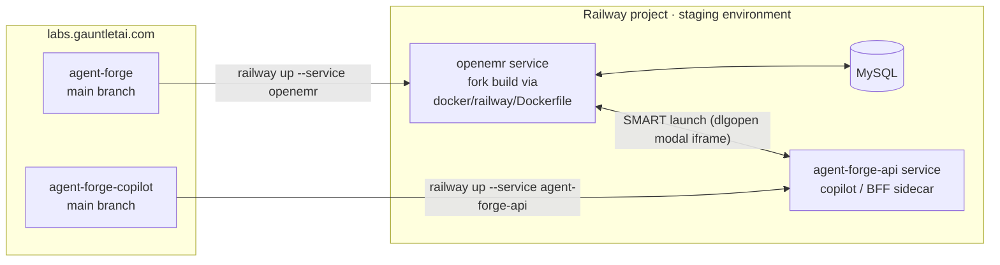

# RAILWAY.md — Deployment Reference

Quick-reference for how this fork is deployed to Railway. Referenced by other
issues/docs as the source of truth for service names, images, and the
load-bearing config values (`SWARM_MODE=yes`, target port 80, etc.). For the
full step-by-step setup runbook and troubleshooting, see
[`docs/DEPLOYMENT.md`](docs/DEPLOYMENT.md).

## Service table

| Repo | App | Railway service | Image / build source |
|------|-----|-----------------|-----------------------|
| `adammarquette/agent-forge` (this repo) | OpenEMR | `openemr` | **This fork**, built from `docker/railway/Dockerfile` (`railway.json`) — *not* the stock `openemr/openemr` image |
| `adammarquette/agent-forge` (this repo) | Database | `MySQL` | Railway's managed MySQL plugin |
| `adammarquette/agent-forge-copilot` | Copilot/BFF sidecar | `agent-forge-api` | That repo's own build (Railpack-detected unless it adds its own Dockerfile) |

All three services live in the same Railway project's **`staging`**
environment (single-environment model — push to `main` in either repo
auto-deploys via GitLab CI). The live project is named `lucid-clarity` in the
Railway dashboard.

## Architecture

Browser flow: a clinician clicks **Launch AgentForge** on the patient chart
(`oe-module-agentforge`) → OpenEMR opens `agent-forge-api` in a modal iframe
with a SMART launch token → the sidecar calls back into OpenEMR's FHIR API
using that token.

## Key facts (cited elsewhere as "per RAILWAY.md")

- **`SWARM_MODE=yes`** must be set on the `openemr` service — enables this
  fork's leader-election and `/swarm-pieces/` restore logic. Without it,
  that coordination is silently skipped.
- **`sites` volume**: mounted at
  `/var/www/localhost/htdocs/openemr/sites`, persists site config, uploaded
  documents, and generated certificates across restarts/redeploys.
- **Target port 80**: the domain's public-networking "target port" only
  controls edge routing. The `PORT` variable must *also* be set to `80` —
  otherwise Railway's healthcheck probes the wrong port and every deploy
  times out after 10 minutes even though Apache started fine.
- **Healthcheck**: `/interface/login/login.php?site=default`, 600s timeout
  (`railway.json`).
- **"Setup Complete!"**: logged by `openemr.sh` once `auto_configure.php`
  finishes on first boot. First deploy is slow (full DB setup); subsequent
  deploys reuse the configured database and the `sites` volume.
- **MySQL wiring**: `openemr` service variables reference the `MySQL`
  service via Railway's `${{MySQL.MYSQLHOST}}` / `${{MySQL.MYSQLPORT}}` /
  `${{MySQL.MYSQLPASSWORD}}` syntax, so credentials follow the database
  service automatically.

See [`docs/DEPLOYMENT.md`](docs/DEPLOYMENT.md) for one-time setup steps,
CI/CD variable configuration, day-to-day workflow, and troubleshooting.
