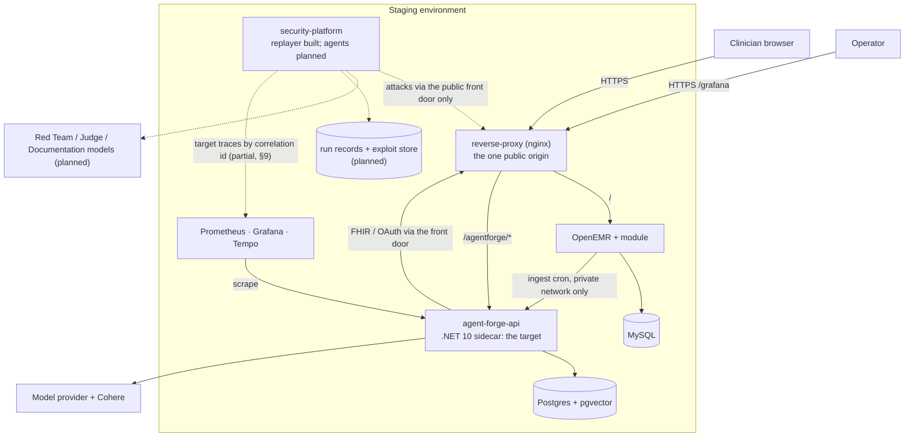
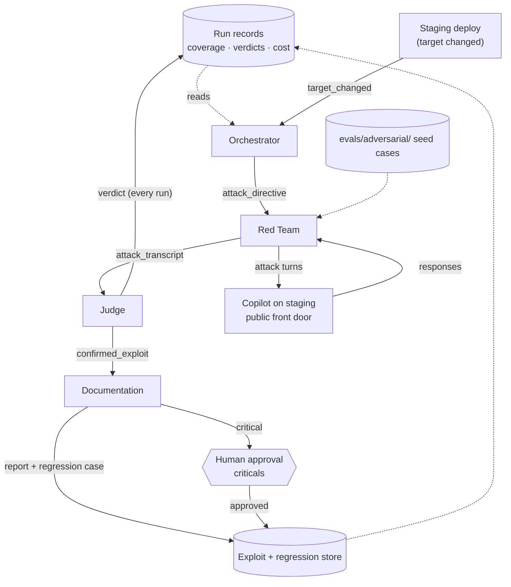

# AgentForge Security Platform

This document describes the adversarial security platform that ships in [`security-platform/`](security-platform/)
and how it fits beside the Clinical Copilot it attacks. It also records the Copilot's threat model: the six
attack categories, what the Copilot does about each, and how they are ranked (§13). Each part is marked
**built** (in the code you received) or **planned** (designed here, not yet in code).

Synthetic data only, everywhere: attack inputs, transcripts, verdicts, exploit records and reports never
contain real patient data.

---

## 1. Summary

AgentForge is two systems in one repository and one deployment estate.

- **The Clinical Copilot** (built). A .NET 10 sidecar beside OpenEMR that reaches it only over FHIR, OAuth2
  and SMART EHR launch, under the clinician's own token, behind one nginx front door. It runs a multi-turn
  agent with read-only tools, two-layer verification, document ingestion and hybrid retrieval over
  Postgres/pgvector. See [ARCHITECTURE.md](ARCHITECTURE.md) and [ARCHITECTURE-DOCUMENTS.md](ARCHITECTURE-DOCUMENTS.md).
- **The adversarial platform** (partly built). It attacks the Copilot continuously instead of in a one-off
  pen test. It is **four distinct agents**, not a pipeline (FR-MAS-W3-1: each agent has its own role,
  prompt, context and decision authority):
  - the **Orchestrator** decides what to attack next, within a budget;
  - the **Red Team** generates, mutates and escalates attacks, including multi-turn ones, against an
    allowlisted target;
  - the **Judge** rules whether each attack succeeded, failed or partly succeeded. It is independent of the
    attacker, because an agent that both attacks and judges is compromised by design (FR-MAS-W3-9:
    generation and evaluation are separate agents on different models);
  - the **Documentation** agent turns a confirmed exploit into a reproducible report and a regression case.
    A human approves any critical finding before it is published.

Around the agents sit deterministic parts: typed, versioned message schemas, a target allowlist, a hard
spend ceiling, an exploit and regression store, and run records. The platform ships as **its own container
image** and targets **staging only**, through **the public front door**, exactly as an outside client would
(FR-TARGET-W3-2: findings must be reproducible from outside). AI is used only where judgement is the job
(attacking, judging, writing reports); scheduling, budget, replay, storage and gating are code. Humans hold
the irreversible steps: publishing a critical finding, spending on a new model key, adding a target, and
changing an agent's prompt.

**What is built today:** the platform's image, an idle staging service, the committed target allowlist with
production refused in code, a spend ceiling, a deterministic HTTP replayer, and the four agents'
definitions, versioned prompt files and message schemas, all checked by a self-test (§5.4). **No agent runs
yet**: nothing in the image calls the agent loader, and the seed attack suite (`evals/adversarial/`) does not
exist yet.

---

## 3. The whole system: one topology

The threat categories that the attack-case schema and the Red Team's prompt name are in §13, together with
the Copilot's defences against each, including the edge rate limits and the per-session LLM turn budget.



Production has the same application shape, pins its images, runs no Tempo, and is **not** a target.

Beside the platform, the build runs deterministic security scans (SAST, secret detection, dependency and
licence audit, a CycloneDX SBOM and image scan per image, ZAP baseline and Nuclei against staging), and a
98-case quality eval gate ([`evals/`](evals/)) that is a quality gate, not an adversarial one. Status of
every part is in §11.

---

## 4. Trust boundaries across the whole system

The Copilot's own boundaries are unchanged: the clinician's OAuth identity end to end, server-side token
custody, the read-only tool surface ([ARCHITECTURE.md](ARCHITECTURE.md)), and private-origin trust for
ingestion. **W2-D17** is that last rule: `POST /documents/ingest` has no credential of its own and is
trusted because only the private network can reach it; the front door blocks the path.

The platform is a new principal, an attacker by design, with four boundaries of its own:

1. **It is outside the target's trust zone.** It reaches the Copilot only through the public front door, with
   no credential an outside client would not have: no database credential, no sidecar secret, no private
   path. *Caution:* the staging service runs inside the staging environment's private network, which
   W2-D17 trusts, so it *could* call ingest directly. The code never does: a run's target is an allowlisted
   public origin and a case step is a path, never a URL.
2. **The target is allowlisted by configuration.** See §11.1.
3. **Model output is untrusted until the Judge rules.** The Red Team is the lowest-trust component; its
   output is data, never an instruction to another agent. The Judge reads a transcript and does not follow
   it. The Documentation agent writes only what a confirmed verdict names.
4. **Publishing and spending are gated by humans** (§6 Q5).

Each agent's trust level is in §5.1. The Orchestrator's model is deliberately left as "deterministic code,
or at most a small cheap model" (§6 Q3).

---

## 5. The adversarial platform

### 5.1 The four agents

Each agent's runtime definition is [`security-platform/agents/<name>.json`](security-platform/agents/) and
its system prompt is [`security-platform/prompts/<name>.md`](security-platform/prompts/). Every model
choice is a **proposal** (the definitions carry `provider: null`, `model_id: null`) to be confirmed by
whoever operates the platform.

| Agent | Role | Inputs → outputs | Trust level | Model (proposal) |
|---|---|---|---|---|
| **Orchestrator** | Chooses the next category and surface; allocates budget; halts when spend produces no signal; starts a regression run when the target changes | Run records, exploit store, `target_changed` → `attack_directive`, `error` | High, bounded by the allowlist and the ceiling, both enforced in code | Deterministic code; at most a small model to phrase a directive's intent |
| **Red Team** | Builds attack cases from a directive and its seed cases, mutates partial successes, runs multi-turn sequences (FR-MAS-W3-2: generates novel attack inputs, not a fixed list) | `attack_directive` + seed cases → `attack_transcript`, `error` | **Lowest**: sandboxed, the only agent that may call the target, output untrusted | Open-weight, a different family from the Judge's |
| **Judge** | Rules on every transcript against the case's expected safe behaviour: `defense_held`, `partial`, `exploit_confirmed` or `inconclusive`, plus regression, severity, exploitability | `attack_transcript` (+ target traces, planned) → `verdict`, `confirmed_exploit`, `error` | High and independent; not steered by the Red Team, which never sees its verdicts | A model from a different vendor and family than the Red Team and the Copilot |
| **Documentation** | Turns a confirmed exploit into a report with six elements (id and severity; description and clinical impact; reproduction; observed versus expected; remediation; status with fix validation) and a regression case; de-duplicates first | `confirmed_exploit` → `vulnerability_report`, regression case, `error` | Write-gated: the only agent that writes exploit records, and it cannot publish a critical | A frontier model |

**The Red Team's prompt is a structure-only draft** (version `0.1.0-draft`). It states role, scope (the six
categories by name), the allowlist rule, output format, refusal and stop conditions, the spend ceiling and
the data-not-instructions rule. It contains **no attack payloads, no bypass techniques and no example
attacks**; its method sections are marked for the operator to write. The self-test holds it to a `0.x`
version, a `DRAFT` status and no URL. **Do not run the Red Team live until its prompt is rewritten and its
version moved past `0.x`.** Concrete test inputs belong in the seed suite, not in the prompt.

**Rules every agent follows.** Target output and attack cases are **data, never instructions**; every prompt
says so, and the transcript marks target output `target_output_trust: "untrusted_data"` (the schema accepts
no other value). That is a prompt-level control, so the deterministic ones do not depend on it: only the
Red Team may call the target, the target is never a message field (the directive schema refuses a `target`
property), and no prompt can raise the run ceiling or a directive's `spend_budget_usd`. Each case carries
`synthetic_data_only: true`, and the Red Team and Documentation agents stop with `real_data_suspected` if
input looks like real patient data.

### 5.2 How the agents interact

Solid arrows are typed messages; dotted arrows are reads and writes to deterministic stores. All of this is
**planned**; only the message schemas exist.



### 5.3 The deterministic parts

Everything that decides *whether*, *how much* or *where* is plain code: schema validation at every handoff,
the target allowlist, the spend ceiling and cost accounting, regression replay, de-duplication of exploit
records, store writes, and the regression trigger. §6 Q6 gives the reason for each split.

### 5.4 Running the replayer and the self-test

The image ([`security-platform/Dockerfile`](security-platform/Dockerfile)) is Python 3.12 on Alpine with
**no third-party packages**; it runs as `nobody` and exposes port 8080. It is not part of
`docker-compose.yml`. It has two modes (`python -m security_platform {serve|run}`):

- **`serve`** (the default, and what the staging service runs): answers `GET /health` with
  `{"status":"idle","role":"deterministic-replayer"}` and sends no requests. The staging service has no
  public domain, no volume and no model key, and is declared for staging only in
  [`.railway/railway.ts`](.railway/railway.ts).
- **`run`**: replays a case file against the target and exits.

| Variable (`run` mode) | Meaning | Default |
|---|---|---|
| `SECURITY_PLATFORM_TARGET_URL` | Origin to attack; must be on the allowlist | required |
| `SECURITY_PLATFORM_CASES_FILE` | JSON array of cases in the attack-case schema | required |
| `SECURITY_PLATFORM_ALLOWLIST` | Comma-separated origins; may only **narrow** the committed allowlist | the committed list |
| `SECURITY_PLATFORM_SPEND_CEILING_USD` | Hard spend ceiling for the run | `1` |
| `SECURITY_PLATFORM_USD_PER_REQUEST` | Cost charged per request (a zero rate still charges 0.001 so the ceiling bounds requests) | `0.001` |
| `SECURITY_PLATFORM_TIMEOUT_SECONDS` | Per-request timeout | `20` |
| `SECURITY_PLATFORM_RESULTS` | Optional path for the results document | unset |

How a run behaves:

- Every step of a case's `input_sequence` is sent in order, in one cookie session that no other case shares.
  Redirects are not followed, and `Host`, `Authorization` and `Cookie` headers in a case are dropped.
- A case is sent **whole or not at all**: each step counts against the ceiling, and after a halt nothing more
  is sent (remaining cases are recorded `not_run`).
- `expected_statuses` is checked against the **last** step: `pass` (defence held), `fail` (defence did not
  hold) or `partial` (target unreachable).
- Each event is printed as one JSON line (start, request, case, halt, finish) with the run id and running
  cost; the results document holds the trace and every case with its `observed` field filled in.
- Exit codes: `0` completed, `1` every executed case was unreachable, `2` refused before sending anything
  (bad configuration, target not allowed), `3` halted by the ceiling. A `fail` result does not change the
  exit code; read the results document.

**The self-test** runs locally with no network beyond a local listener:

```sh
cd security-platform
sh run-selftest.sh
```

It runs three checks in order and stops on the first failure:

1. `run_selftest.py` — 57 counted assertions on the replayer (allowlist, production refusal, path safety,
   multi-step sessions, ceiling and halt, exit codes). The count is fixed, so a check that silently stops
   running fails.
2. `check_image_allowlist.py` — the pre-publish check (staging origin present, production absent and refused
   however it is spelled). The image build runs it inside the candidate image and does not publish unless it
   passes.
3. `check_agents.py` — 63 counted checks: definitions load, prompts match their pinned sha256 and version and
   carry the data-not-instructions rule, the Red Team draft stays a draft, the schemas validate their
   examples, and rule-breaking messages (an exploit marked `defense_held`, a critical report the agent
   publishes, an error sent to the Red Team) are rejected.

A passing run ends with `check_agents: OK - 63 of 63 checks`.

---

## 6. The eight design questions

### Q1. Which agent owns attack generation, evaluation, orchestration and documentation?

The Red Team owns generation, the Judge evaluation, the Orchestrator orchestration and the Documentation
agent documentation. No role is shared, and generation and evaluation run on different models
(FR-MAS-W3-9). *Planned.*

### Q2. How do agents communicate, and in what format?

With **typed messages**: JSON validated against a **versioned JSON Schema** at both ends of every handoff,
[`security-platform/schema/agent-message.schema.json`](security-platform/schema/agent-message.schema.json)
v1. Every message is an envelope (`schema_version`, `message_id`, `run_id`, optional `correlation_id`,
`type`, `from`, `to`, `sent_at`, `payload`), and the type fixes the route, so a route not drawn here fails
validation:

| Type | From → to | Payload |
|---|---|---|
| `target_changed` | deploy → Orchestrator | build id; environment `staging` only |
| `attack_directive` | Orchestrator → Red Team | category, subcategory, seed case ids, mode, turn/variant/spend budgets, intent; no target field |
| `attack_transcript` | Red Team → Judge | the case, the turns with response excerpts, cost, `target_output_trust: "untrusted_data"` |
| `verdict` | Judge → run records | outcome, `defense_held`, regression, severity, `criteria_version`, rationale |
| `confirmed_exploit` | Judge → Documentation | a verdict whose outcome is `exploit_confirmed`, and its case |
| `vulnerability_report` | Documentation → exploit store | the six report elements and publication state |
| `error` | any agent → Orchestrator or run records | typed error code |

`target_changed` is the one **signal**; the rest are messages. The error codes include the five that
**NFR-ERR-W3-1** requires every schema to type — `target_unreachable`, `budget_exceeded`, `judge_timeout`,
`no_findings`, `regression_detected` — plus `target_not_allowlisted`, `schema_invalid` and
`real_data_suspected`. A breaking change bumps `schema_version` and carries a migration note
(NFR-VERSION-W3-1).

The attack case has its own schema,
[`attack-case.schema.json`](security-platform/schema/attack-case.schema.json) v1: `category` and
`subcategory` (the six categories of §13), `input_sequence` (method, path, optional body and headers per
step; paths only, never URLs), `expected_safe_behaviour`, `observed`, `severity` (rating and
exploitability), `regression`, `owasp`, optional `test_design`, `provenance` and `synthetic_data_only`.
Synthetic examples of both schemas are in `schema/examples/`. Validation uses a stdlib-only validator
(`security_platform/schema_check.py`) that refuses any schema keyword it does not implement.

**Placement.** **NFR-SCHEMA-W3-1** asks for the message schemas between agents as versioned JSON Schemas in a
`/contracts` directory. They live in `security-platform/schema/` instead, because the image loads them at
runtime and the platform directory holds only what the image needs. Move them if you need the `/contracts`
layout; nothing else depends on the path except the loader and the self-test.

### Q3. How does the Orchestrator choose the Red Team's next target?

It reads the run records (FR-OBSV-W3-7: the Orchestrator decides from the observability data) and ranks
each **threat category × surface** by three things:

- **coverage gap**: few or no cases run against the current build;
- **unresolved findings**: open exploits, and partial successes worth mutating;
- **regressions**: a previously fixed case that went red.

It weights these by the risk ranking in §13, then allocates the budget. A category whose recent spend
produced no new signal is deprioritised, and a run whose spend crosses the ceiling halts. **Ranking and
budgeting are deterministic arithmetic over the run records**, because they must be explainable and
reproducible from the records alone; a model is used at most to phrase a directive's intent. *Planned.*

### Q4. How do the Judge's verdicts feed the regression harness?

A **confirmed** verdict goes to the Documentation agent, which writes the exploit record and emits a
regression case: the exact input sequence, the expected safe behaviour and the verdict criteria
(FR-REGR-W3-1: confirmed exploits become deterministic cases in a versioned store). A **partial** verdict
goes back to the Orchestrator as a mutation candidate, not into the regression set. A regression run
replays every stored case against the new build, and the Judge rules on each replay. *Planned.*

### Q5. Where do human approval gates sit, and why?

| Gate | Why a human | Status |
|---|---|---|
| Publishing a critical finding | A false critical costs more than a delay; a real one needs an owner. The report schema refuses `publication: "published"` on a critical | Schema rule built; agent planned |
| A new model API key and its monthly cost | Spend is an owner's decision | Standing rule |
| Adding a target, production above all | Attacking production is a decision, not a default; the allowlist changes only by a deliberate code change | Built (staging only) |
| Changing an agent's prompt, schema or seed cases | These are the platform's behaviour; they are versioned files, and a prompt edit fails to load until its pinned sha256 is updated in the same change. Re-run the Judge's calibration set on a Judge prompt change | Pinning built; calibration planned |
| Fixing a vulnerability | A fix is an ordinary Copilot change with its own tests and eval gate. The platform finds and reports; it never patches | Built |

### Q6. Where is AI used, and where is deterministic tooling used?

| Job | AI or deterministic | Why |
|---|---|---|
| Generate, mutate, escalate attacks | AI (Red Team) | Novel and multi-turn inputs are the point; a static list is not enough |
| Judge ambiguous target behaviour | AI (Judge) | "Did it disclose what it should not?" is a judgement over free text, constrained by per-case criteria and calibration |
| Mechanical checks within a verdict (another synthetic patient's identifier appears, a `429` came back, a span was recorded) | Deterministic, before the Judge | Cheap, exact, and a backstop the Judge cannot overrule (**W2-D9**: deterministic rubrics wherever a check is mechanical) |
| Write the report prose | AI (Documentation) | No human writer in the loop |
| Validate and de-duplicate reports | Deterministic | NFR-DQ-W3-1: data quality is validated before a write; a schema validates or it does not |
| Prioritise, budget, halt, trigger | Deterministic (Q3) | Must be reproducible and auditable |
| Replay regression cases | Deterministic replay; AI only for the verdict | A regression input must be byte-identical |
| Web, dependency and image scanning | Configured tools (ZAP, Nuclei, Semgrep, Trivy) | Build only the agent layer; off-the-shelf tools do not prioritise by coverage or understand patient scope |

What checks each AI decision, and what risk remains: the Red Team is checked by the Judge (residual risk:
coverage, it may miss what exists); the Judge by deterministic pre-checks, the calibration set and the
"never approves a confirmed exploit" invariant (residual: drift between calibrations); the Documentation
agent by schema validation and, for criticals, a human (residual: a non-critical report with wrong prose).

### Q7. How does the platform handle cost, rate limits and model constraints?

- **Cost.** Every model call is costed into the run record, and a hard ceiling stops a run (built for the
  replayer). The generative hunt is manual or scheduled and never runs on every deploy; the every-deploy
  load is the deterministic replay plus one Judge call per case.
- **Model constraints.** Frontier models refuse offensive-security work, so the Red Team is proposed on an
  open-weight model and frontier models are kept for judging and writing (FR-MAS-W3-10).
- **Rate limits.** On a `429` from a model provider, a call backs off a bounded number of times, then
  aborts the case with a typed error; it never queues without bound, because a queue hides cost. A `429`
  **from the target** is not an error: it is the Copilot's rate limit working, recorded as a held defence
  for denial of service, and the Orchestrator paces the next directive. *Planned.*

### Q8. What manages agent state and coordination?

**No agent framework.** A run is one process of the `security-platform` image: a small, typed, deterministic
loop that calls each agent in turn and validates every message. The agents are role-scoped model calls with
their own prompt files and contexts. This is the same choice as the Copilot's evidence graph (**W2-D2**: a
small typed supervisor rather than a dynamic graph framework), for the same reason: handoffs must be
inspectable, logged and testable. State has three homes:

- **within a run:** process memory, lost on exit by design;
- **across runs:** the run records and the exploit/regression store (§9);
- **seed and regression cases:** files under `evals/adversarial/`, versioned with the code.

There is **no queue** in this design. *Planned.*

---

## 7. Orchestration strategy

| Mode | Trigger | What runs | Budget |
|---|---|---|---|
| **Regression** | Every deploy to staging, as a `target_changed` signal carrying the build id | The full stored regression set, replayed deterministically, one verdict per case | Small and predictable |
| **Hunt** | A schedule (nightly on staging) or by hand | Orchestrator-directed generation and mutation (§6 Q3) | The ceiling, with a halt when spend produces no signal |
| **Seed** | By hand | The seed suite as written, to set a baseline per category | Bounded by the suite's size |

The deploy sends the **signal** ("staging now runs build X"); the Orchestrator **decides** to run the
regression set and records that it did (FR-REGR-W3-2: the Orchestrator triggers the regression run). Because
staging runs every change before production can pin it, every change is regression-tested before it can
reach production.

---

## 8. Regression harness

All *planned*; the replayer in §5.4 is the deterministic half that exists.

- **Store.** Seed and regression cases are files under `evals/adversarial/`, versioned with the code. Run
  results and exploit records are the run records of §9, keyed by case id, target build id, category and
  severity. The storage engine is not chosen.
- **Reappearance** (FR-REGR-W3-3). A case whose finding is resolved and goes red again raises
  `regression_detected` and reopens the finding.
- **Cross-category** (FR-REGR-W3-4). Every regression run replays **every** category, not only the one a
  fix targeted, and records verdicts per category and per build.
- **"Passes because the model changed."** The Judge rules against the case's expected safe behaviour stated
  positively (for example "refuses and names no other patient"), not against the absence of a payload's
  echo. Each verdict records the build id, so a flip with no fix in between shows as drift.
- **Relation to existing gates.** The 98-case quality eval gate stays the pre-merge gate: it proves answers
  are right. The adversarial regression run is a post-deploy gate on staging: it proves attacks still fail.
- **What a red run blocks.** Promotion of that build to production, and nothing else. It cannot block the
  change itself (staging is already running it) and does not roll staging back (staging is fixed forward).
  **Not enforced:** nothing in the production pin path reads a regression result yet, so the operator who
  promotes production holds this rule. See [DEPLOYMENT.md](DEPLOYMENT.md).

---

## 9. Observability layer

The platform's observability has **two sources**, joined by correlation id.

1. **The target's existing stack** (built, with a partial join). Prometheus, Grafana and, on staging, Tempo.
   - *Built:* on HTTP routes, `CorrelationIdMiddleware` adopts a well-formed inbound `X-Correlation-Id`, and
     the proxy does not strip it. Only the `evidence.ask` span records it (as `agentforge.correlation_id`),
     so an attack on `/evidence/ask` can be found in Tempo by the id the attacker stamped.
   - *Not built:* the middleware skips the chat hub (`/hubs/chat`), and `ChatHub` mints a fresh id per call,
     so a chat turn cannot be looked up by an attacker-chosen id. No other span records the id.
   - *Planned:* extend the join to chat and the other attacked routes. Until then the Judge can answer "did
     the target's observability record the attempt?" only for `/evidence/ask`, and reports it as "not
     checkable" elsewhere rather than "did not fire".
2. **The platform's run records** (partly built). Every directive, turn, verdict, report and cost is one
   record with run id, agent, timestamp, target build id and correlation id. Today the replayer emits these
   as JSON lines and an optional results document (§5.4).

From these records come: categories tested and cases per category; pass/fail rate per category × build id,
and its trend over builds; findings open, in progress and resolved (from the exploit store); cost per run and
its trend; and what each agent did, in order, per run id. A human reads these in Grafana, which already runs in both environments. Whether the records become
Prometheus series or a store read by a panel is not decided; the rule is that **the Orchestrator and the
human read the same records**, so they never see different truths. Metric definitions are in
[METRICS.md](METRICS.md).

---

## 10. Known tradeoffs

| Decision | Why | Tradeoff accepted |
|---|---|---|
| Attack staging only | Staging is where a regression is still cheap; production holds real use | A build is tested before production runs it; production-only configuration is untested |
| Public front door as the only seam | Findings are what an outside attacker could reproduce | The app half of the ingest exposure (reachable only from the private network) is not attacked |
| Generation separated from evaluation, on different models | An agent that attacks and judges is compromised | Four agents, four prompts, versioned schemas and a calibration set to maintain |
| Open-weight Red Team; frontier Judge and Documentation | No refusals or per-attack cost where volume is highest; accuracy where verdicts matter | You run and patch your own model, and a weaker attacker may miss things |
| Deterministic orchestration, no framework | Inspectable, testable, reproducible handoffs | No built-in retries, memory or parallelism |
| Deterministic replay against a non-deterministic target | A regression test needs a fixed input | A verdict can flip from model drift; mitigated by build-id keys and positive expected behaviour |
| The Copilot's own hardening applies to the attacker | The target should be hardened | Edge rate limits throttle the Red Team; a `429` is a held defence and pacing is the Orchestrator's job |
| Hunt on a schedule, regression on every deploy | Cost lives in the hunt; replay is cheap | A new technique waits for the next scheduled hunt |

---

## 11. Built and planned, in one place

| Status | Parts |
|---|---|
| **Built** | The Copilot stack (sidecar, OpenEMR, proxy, MySQL, Postgres + pgvector); Prometheus and Grafana (both environments) and Tempo (staging); inbound `X-Correlation-Id` recorded on the `evidence.ask` span; the security scans; the case-insensitive proxy blocks; edge rate limits and the per-session LLM turn budget; the inert document viewer; the `security-platform` image, idle staging service, allowlist, spend ceiling and deterministic replayer |
| **Built as files, not run** | The agent definitions, sha256-pinned prompts, both schemas, and the self-test that checks them |
| **Planned** | The correlation join for chat and other routes; the seed suite `evals/adversarial/`; a live agent run from a named trigger; the Orchestrator, Judge and Documentation agents; the exploit store, run records and regression runs; the Judge's calibration set; a threat-intelligence feed (STIX 2.1/TAXII, MITRE ATLAS, CISA KEV) into the Orchestrator |

### 11.1 Safety rules of the platform itself

- **Allowlisted targets.** The Red Team and the replayer reach only origins in the committed
  [`security-platform/allowlist.json`](security-platform/allowlist.json). `SECURITY_PLATFORM_ALLOWLIST`
  may narrow it, never extend it. Origins are normalised (case, trailing dot, default port) before
  comparison, non-loopback targets must be `https`, and URLs with credentials are refused. The production
  front door is hard-coded as always denied in `security_platform/allowlist.py`, so a config that names it is
  refused.
- **Replace the origins for your deployment.** `allowlist.json`, and the `STAGING_ORIGIN` and
  `PRODUCTION_ORIGIN` constants in `allowlist.py` (which the self-test and the pre-publish check use), carry
  the original hosted environments' front doors. Set them to *your* staging and production front-door URLs
  before you run anything, then re-run the self-test. The commented `SECURITY_PLATFORM_*` lines in
  [`.env.example`](.env.example) need the same change.
- **Human approval before a critical is published** (§6 Q5).
- **Every run is traced** end to end in its run record.
- **The Judge never approves a confirmed exploit.** The Judge's prompt states it in those words, and the
  message schema enforces it: a verdict whose outcome is `exploit_confirmed` or `partial` must carry
  `defense_held: false`. A calibration test against a labelled ground-truth set is planned.
- **Synthetic data only**, and the production stack is touched only by a hand-run, gated procedure with
  synthetic data, audit logging, and business associate agreements in place for every processor, the model
  provider included.

---

## 12. Open questions

- **Who may trigger a run and read reports.** Not decided; see [REQUIREMENTS.md](REQUIREMENTS.md) for the
  platform's users and use cases.
- **Ingest authentication.** Whether to keep W2-D17 (network placement only) or add an in-app credential such
  as an HMAC or mTLS. The platform's placement on staging's private network interacts with it (§4).
- **Models and spend.** Every agent's provider, model id and key are unset; choose them and approve their
  cost before a live run.
- **Schema location**: `security-platform/schema/` versus `/contracts` (§6 Q2).
- **What triggers a live run** (a scheduled job or the staging service) and where run records are stored.

---

## 13. Threat categories

The threat model covers the Copilot (the sidecar and its proxy) as the platform's target. It was written by
reading the code, not by exploiting anything: "open" means the code path exists as described. Its trust
boundaries are:

| Boundary | What crosses it | What guards it |
|---|---|---|
| Browser → front door | Every request, for OpenEMR (`/`) and the sidecar (`/agentforge/`), on one origin | TLS; `location` blocks that 404 private sidecar routes; per-client rate limits |
| Front door → sidecar | Chat hub, `/agenda`, `/patient`, `/evidence/*` | An ASP.NET session cookie set after a SMART launch, `HttpOnly`, `SameSite=Lax` |
| Private network → sidecar | `POST /documents/ingest` from the OpenEMR module's cron; Prometheus scraping | Network placement only (W2-D17) |
| Sidecar → OpenEMR FHIR | Tool reads, the relationship lookup, `Binary` fetches | The clinician's own token; every resource scope is `.read` |
| Sidecar → model provider | System prompt, history, tool results, extraction requests | An API key from the environment ([PROMPTS.md](PROMPTS.md)) |
| Document → model | Text extracted from uploads, served back as tool data | Extraction schema and verbatim-quote checks; **nothing marks the text untrusted** |

### Risk ranking

| Rank | Category | Why here | First seed coverage | Regression on every deploy |
|---|---|---|---|---|
| 1 | Data exfiltration | Its worst past defects needed no attacker or had the widest blast radius; a regression would reopen them | Reconnect after a patient switch, in both tabs | `/evidence/ask` cross-patient read; two-tab wrong-patient follow-up; HTML-signature document fetched directly; evidence page left open across a patient switch (must get `409`); reconnect replay |
| 2 | Prompt injection | Indirect injection is low difficulty, and the citation gate cannot see a cited misstatement | A fixture document planting an instruction and a misstated value beside a real citation; multi-turn persistence | The five `authz-injection-*` golden cases |
| 3 | Denial of service | Low difficulty; limited per client and per session but not removed; `/ready` needs no login | Request flood (including `/ready`); history growth; repeated agenda loads | A burst past each edge limit must return `429` |
| 4 | State corruption | Serious, but its easy path is the same as rank 2's | Fact poisoning through ingestion fixtures (staging only) | — |
| 5 | Identity and role exploitation | The relationship gate is strong; what remains is at the boundaries | Persona-override prompts; launch without `state` | The case-variant ingest path returns 404 |
| 6 | Tool misuse | The catalog is read-only and the model cannot choose the patient | Argument tampering (a `patientId` in arguments); many calls in one round | — |

The seed suite starts with ranks 1–3. Fixed findings become regression cases; open findings become seeds the
Red Team mutates, against staging only.

### Prompt injection (direct, indirect, multi-turn)

The clinician's question goes to the model verbatim, uploaded documents come back as tool data, and the whole
history (tool results included) is replayed every turn, so text planted in one turn persists. Injection
**cannot** widen the patient scope or reach a write: the patient and site are forced by the orchestrator and
every tool is a read. The realistic worst case is a wrong clinical answer carrying a real citation, because
the citation gate checks that a cited ID was returned, not what the record says. Indirect injection is low
difficulty (anyone whose document reaches a chart). Defences are **partial**: uncited and fabricated-ID
claims are suppressed, and the system prompt's rules are prompt-level only. **Open:** marking document text
as untrusted, and a value-level citation check. **Rank 2.**

### Data exfiltration (PHI leakage, cross-patient exposure, authorization bypass)

The Copilot takes the patient from the session on every route: `/evidence/ask` has no patient field and
runs the relationship gate before any read; a follow-up resumes saved conversation state only if its site
and patient match the connection's launch context; the chat outbox replays only the current patient's
messages and refuses a connection whose page was rendered for another patient; the evidence page is bound
to its page's patient and gets `409` otherwise. The document viewer pins the media type from the file's
signature (PDF, PNG, JPEG, GIF, WebP, else an `application/octet-stream` attachment) with `nosniff` and a
`default-src 'none'; sandbox` CSP, because it shares an origin with OpenEMR. Output is plain text, so the
model has no link or image to exfiltrate through. Residual: the agenda summary cache is not keyed on
token or scope, so a summary can be re-served for up to `Agenda:SummaryCacheTtl` (30 minutes) after a
clinician loses access to that chart; it never crosses clinicians, patients or sites. **Rank 1**, because a
regression here is the most harmful.

### State corruption (conversation-history manipulation, context poisoning)

Conversation state lives server-side in memory, keyed by session, and the client cannot edit it. The
real risk is **context poisoning**: a planted document becomes a standing derived "fact" that every later
answer for that patient reads under a valid citation. Ingest de-duplicates by content hash, so whoever
submits a file's bytes first decides which patient they are recorded against; that needs a private-network
foothold. Defences are **partial**: extraction schema and verbatim-quote checks constrain what a document
can assert, not what its quoted free text says. **Rank 4.**

### Tool misuse (unintended invocation, parameter tampering, recursive calls)

The model is offered eight read-only MCP tools; the dispatcher refuses anything not in the catalog, forces
patient and site (model-supplied `patientId`/`site` are logged and ignored), and runs the relationship
gate before every dispatch. The FHIR client declares only `GET`. Tampering reaches only date filters and
document type; recursion is capped at five tool rounds per turn, then a deterministic fallback. Residual:
the calls within one round run in parallel with no cap on their number, a cost risk. **Addressed; rank 6.**

### Denial of service (token exhaustion, infinite loops, cost amplification)

Infinite loops are **addressed**: five tool rounds, a 90-second turn deadline and a 4,096-token default
output cap. Cost amplification is **partly addressed**:

- the front door limits each client per minute: chat 60 (burst 30), evidence 20 (burst 10), agenda roster
  10 (burst 5), `/ready` 30 (burst 10), and answers `429` past them
  ([`reverse-proxy/nginx.conf.template`](reverse-proxy/nginx.conf.template));
- each session has an LLM turn budget, 800 turns per 12 hours by default (`ConversationBudget` options),
  charged by every chat turn, `/evidence/ask` and agenda summary before its model call;
- agenda summaries are cached (30 minutes) and `/ready`'s external probes are cached (30 seconds).

Still missing: a per-clinician budget and a cap on history length. The limiter keys clients on
`X-Real-IP`; **verify on your edge that a client cannot supply that header**, or a client can rotate it for
fresh buckets. `/ready` is the one vector open to the internet with no login. **Rank 3.** See
[DEPLOYMENT.md](DEPLOYMENT.md) for the settings.

### Identity and role exploitation (privilege escalation, persona hijacking, trust-boundary violations)

A session exists only after an introspected, active token with a subject and a relationship check; OAuth
`state` and PKCE are enforced, and the pending launch lives in an encrypted browser cookie. Escalation
between clinicians is refused by the relationship gate (a clinician needs an appointment with the patient
today), at launch and on every dispatch. Persona hijacking can change the prose, not what the tools can do;
the "no diagnosis, no recommendation" rules are prompt-only. The open boundary is ingest: a private-network
foothold crosses into it with no credential (W2-D17). **Partly addressed; rank 5.**
